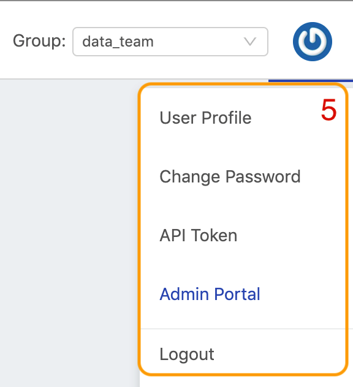
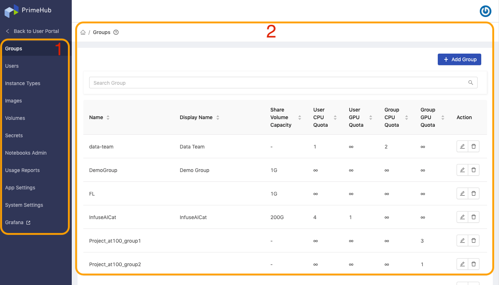

# Platform

**PrimeHub** is a _Kubernetes-based_ platform designed for groups of data scientists. It aims to be an all-in-one, enterprise-level, machine learning platform that provides a seamless MLOps experience.

PrimeHub adopts a group-centric design, which accelerates collaborative development. In PrimeHub, scientists can share datasets, artifacts, and seamlessly collaborate on projects in groups. Models can be developed, deployed, and monitored with full control in a transparent group environment.

Using PrimeHub’s granular controls, administrators can configure access control settings, manage resources, and adjust resource quotas for groups - All facilitating efficient resource utilization.

With the addition of 3rd-party app integration, PrimeHub’s capabilities can be augmented on demand, accelerating the machine learning workflow. These 3rd-party apps also benefit from the access control and resource configurability that is available through PrimeHub, making for a true, all-in-one, MLOps solution.

### Key Capabilities

* Cluster Computing
* One-Click Research Environments
* Easy Dataset Loading
* Management of Resource & Quota Privileges
* Custom Deep Learning Environments
* Enterprise-Class Account Management
* Capability Augmentation via 3rd-party Apps



***

**PrimeHub** is composed of a **User Portal** and an **Admin Portal**. The User Portal provides features aimed at data scientists and team members, and the Admin Portal provides configuration options relevant to platform administrators.

### User Portal

The [User Portal](guides/user-portal/) provides access to a full MLOps feature set. Data scientists can turn workflows into automated pipelines via Jobs/Recurring Jobs; prepare data and develop trained models from Notebooks; deploy container-wrapped models as services via Model Deployment, and more.

<figure><figcaption></figcaption></figure>

#### Landing Page Layout

1. User features
2. Group admin features (Viewable only to the [group admin](technology/concept/privilege.md#group-administrator))
3. Group switch
4. Group context
5. Admin Portal entry (Viewable only the the [platform admin](technology/concept/privilege.md#administrator)) 

### Admin Portal

The [Admin Portal](platform-administration/admin-portal.md) enables platform administrators to manage all aspects of PrimeHub, such as access-control, resources and quota control, building custom environments via image builder etc.

<figure><figcaption></figcaption></figure>

#### Landing Page Layout

1. Platform administrator features
2. Feature context
