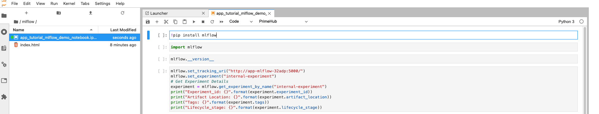
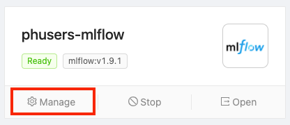
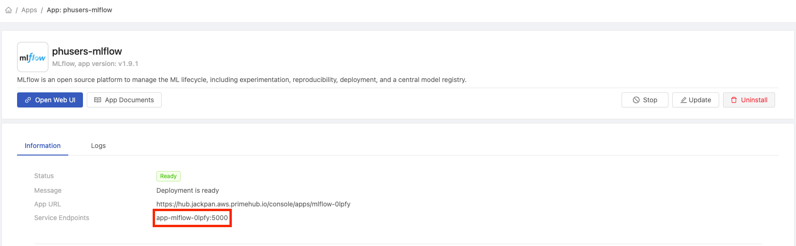
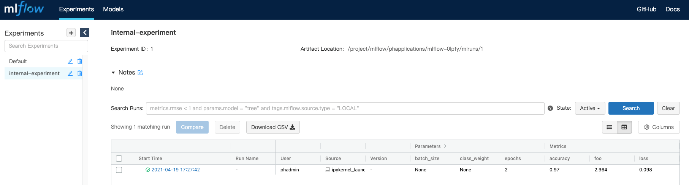

# Create an MLflow server

This tutorial covers the basic flow to help you get started with MLflow in PrimeHub.

### Install MLflow

First, you need to install it in the `Apps` tab. Please check the [Overview](../apps-overview.md) section to learn how to install an App. In the installing process, you can change the `backend store` and `artifact store` environment variables. If you don't know the meaning of the environment variables, can just use the default values or check the [MLflow Official Doc](https://mlflow.org/docs/latest/tracking.html#mlflow-tracking-servers) and Our Setting for more details.

### MLflow UI

PrimeHub shows the app's state in the `Apps` tab. You can open the MLflow UI by clicking `Open` after the state becomes `Ready`.

<figure><figcaption></figcaption></figure>

It will open a new window and show the MLflow UI. You can see your experiments and runs in this UI. We will show you how to record a run in an experiment by using the PrimeHub Notebook function in the next section.

<figure><figcaption></figcaption></figure>

### Use MLflow Tracking in PrimeHub

#### Binding MLflow App to Models (EE Way)

With a running MLflow App, we can bind MLflow service to [Models Management](../../models/models.md). Once binding, on Models, we can view registered models, furthermore deploy these models via Deployments at ease on PrimeHub.

**Steps**

On the **Apps** page, find MLflow and click **Manage**.flow

<figure><figcaption></figcaption></figure>

Make a note of the **App URL** and **Service Endpoints** values.

<figure><figcaption></figcaption></figure>

Click **Settings** in the left sidebar and then click the **MLflow** tab.

<figure><figcaption></figcaption></figure>

In the **MLflow Tracking URI** text field enter the **service endpoints** value we copied earlier, preceded by ‘http://’. E.g. `http://your-service-endpoints`

In the **MLflow UI URI** text field enter the **App URL** value we copied earlier. Then, click the **Save** button.

<figure><figcaption></figcaption></figure>

####

#### Using MLflow API from Notebook (CE Way)

* The image `infuseai/docker-stacks:tensorflow-notebook-v2-4-1-5b5a244c`
* An instance type >= minimal requirement (CPU=1, GPU=0, Mem=2G)
*   The prepared notebook file of the example

    Download app\_tutorial\_mlflow\_demo\_notebook.ipynb
* Choose a group with enabled Shared Volume (a.k.a Group Volume)



> Please have the image, the instance type on PrimeHub, or request administrators for assistance before we start.

**Steps**

1.  Enter Notebook from User Portal, select the image, the instance type, and start a notebook.&#x20;

    <figure><figcaption></figcaption></figure>
2. From File Browser of Notebook, navigate into the directory of `<group_name>` which is a Group Volume; here **mlflow** is our working group.
3. While inside the group volume, copy/drag the downloaded `app_tutorial_mlflow_demo_notebook.ipynb` there in File Browser and open it.
4.  Open the notebook, and change the line `mlflow.set_tracking_uri("http://app-mlflow-32adp:5000/")` into the proper link based on the detail page in the `Apps` tab.&#x20;

    <figure><figcaption></figcaption></figure>
5.  Copy the Service Endpoint value and replace `app-mlflow-32adp:5000` in the notebook to this value.&#x20;

    <figure><figcaption></figcaption></figure>
6.  **Run All Cells** in the notebook, you will see a new run in `internal-experiment` in the MLflow UI.&#x20;

    <figure><figcaption></figcaption></figure>

That's the basic use of how to track your machine learning experiments by using MLflow and PrimeHub.
