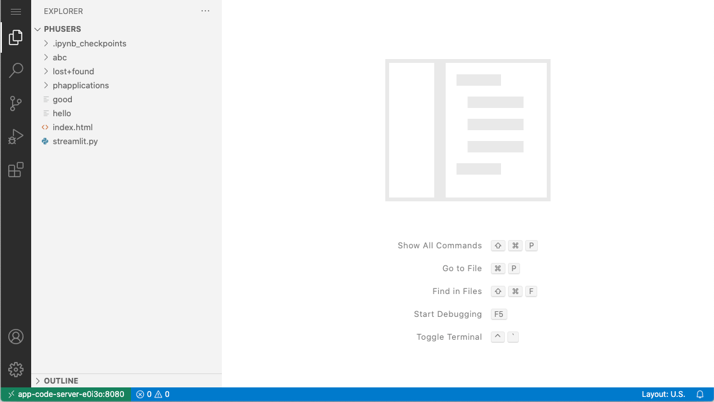

# Code Server

### Introduction

Run VS Code on any machine anywhere and access it in the browser.

| Property         | Description                                                             |
| ---------------- | ----------------------------------------------------------------------- |
| App Image        | [`codercom/code-server`](https://hub.docker.com/r/codercom/code-server) |
| Official Website | https://github.com/cdr/code-server                                      |

### Screenshots

<figure><figcaption></figcaption></figure>

### Usage

1. Create a code server app and open it
2. In the code server, open the menu at the upper-left corner
3. Click _File > Open_ to open a folder
4. Select `/project/<group-name>/path/to/your/folder`, and click `OK`
5. Happy coding ;)

### Troubleshooting

If you show a blank page when opening the code server app, please check if there is a code server opened in another browser tab. If yes, please close the tab and reload again.
