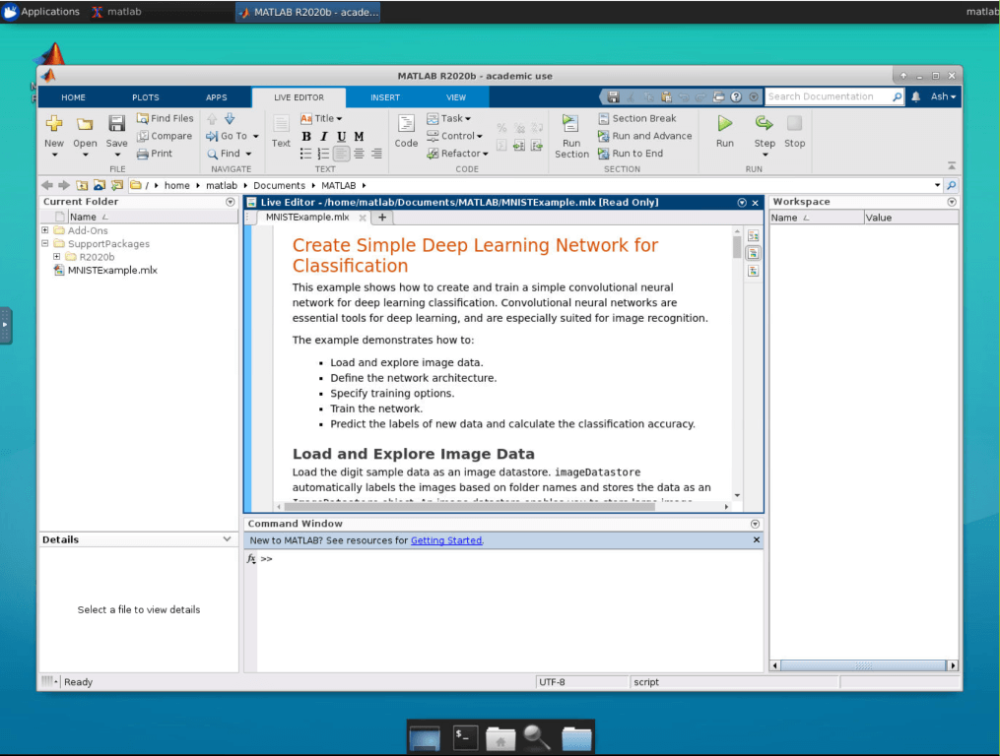

# MATLAB

Enterprise Applicable to Enterprise EditionCommunity Applicable to Community Edition

### Introduction

MATLAB is a programming and numeric computing platform used by millions of engineers and scientists to analyze data, develop algorithms, and create models.

| Property         | Description                                                                                      |
| ---------------- | ------------------------------------------------------------------------------------------------ |
| App Image        | [`nvcr.io/partners/matlab`](https://ngc.nvidia.com/catalog/containers/partners:matlab)           |
| Official Website | [https://www.mathworks.com/products/matlab.html](https://www.mathworks.com/products/matlab.html) |

### Screenshots

<figure><figcaption></figcaption></figure>

### Usage

1. Create a MATLAB app
2. After created, visit MATLAB app Web UI and enter your MathWorks account credentials to use MATLAB
