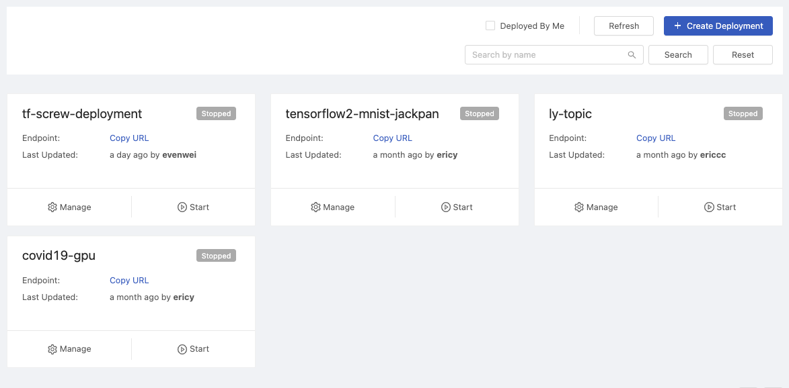
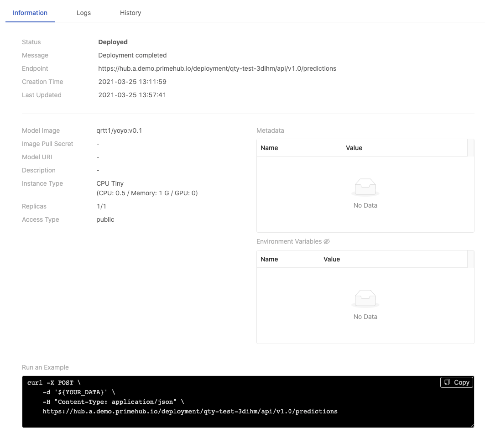
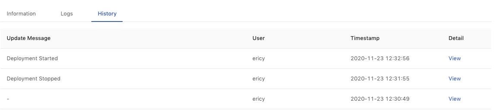
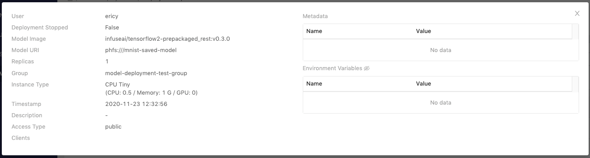
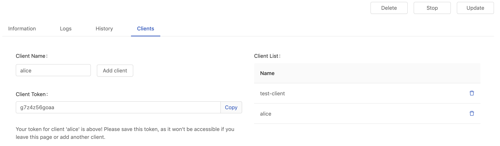
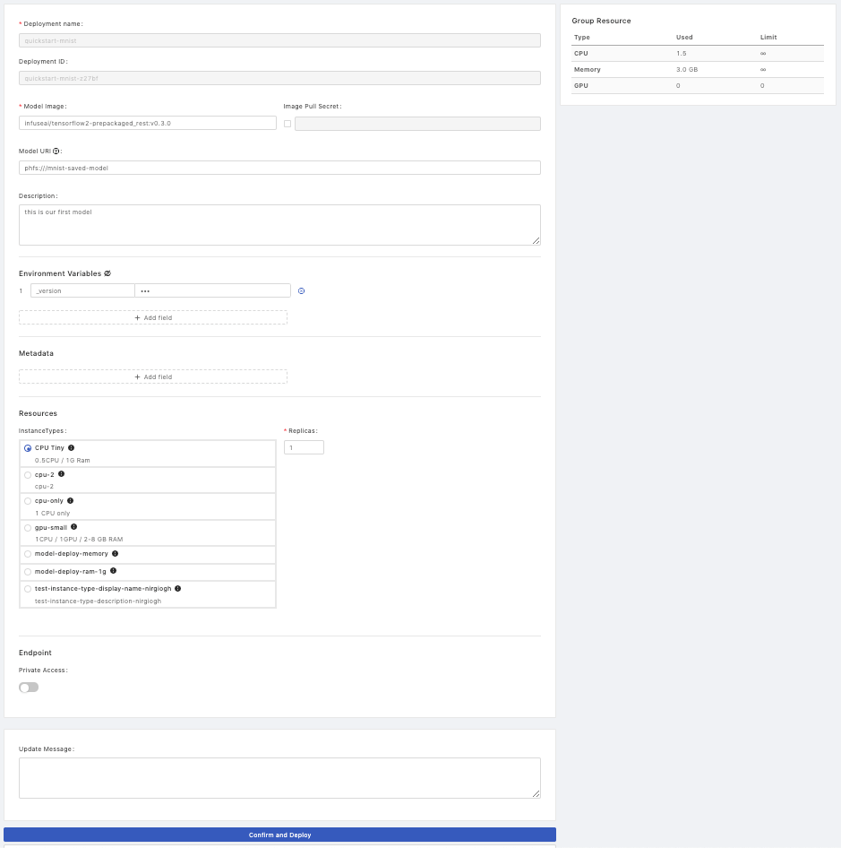
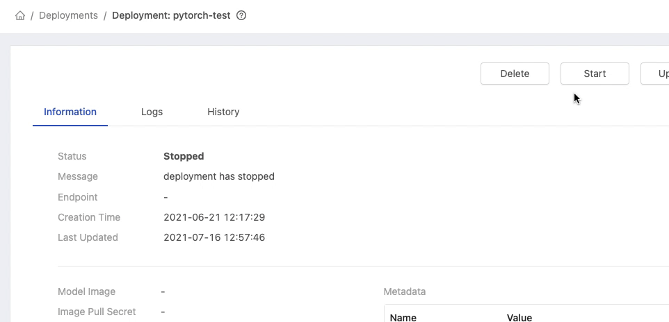
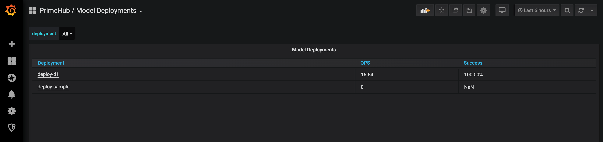
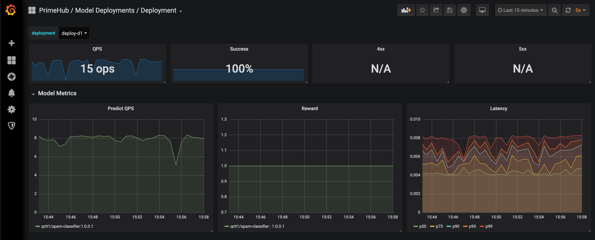

# Deployments

Deployments feature that users are able to deploy trained models as services and to manage these deployments. While model services are online, administrators are able to monitor the status of model service such service health and resources usage information; moreover, users are able to check deployment history and log.

PrimeHub provides two ways of Model Deployment, one is to deploy a model image directly which has wrapped a model file into, the other is to specify a model file and a pre-packages server image as a deployment, under the hood, PrimeHub serves it as a service.

### Enable Model Deployment in Group Management

First, we have to turn on **Model Deployment** in groups.

<figure><figcaption></figcaption></figure>

If the current group's `Model Deployment` is not enabled, it shows a message


Feature not available - Model Deployment is not enabled for this group. Please contact your administrator to enable it.


Please contact Admin to turn on it or switch to a group which `Model Deployment` is enabled.

### Overview

This page displays all of created deployments status.

<figure><figcaption></figcaption></figure>

* `Search by name`: Search deployments by a keyword.
* `+ Create Deployment` button: Clicking for a deployment creation.
* `Refresh` button: Clicking to retrieve the latest statuses of deployments.
* `Deployed By Me`: Checkbox; list deployments deployed by "me".

#### Card

Each card represents a deployment.

| Info         | Description                             |
| ------------ | --------------------------------------- |
| Title        | Deployment name                         |
| Endpoint     | Where the model serve and take queries. |
| Last Updated | Last updated time by `user`.            |
| Status       | Deployed Failed Deploying Stopped       |

* `Manage`: click to view the detail.
* `Start/Stop`: toggle the deployment.


The status, `Deployed`, reflected the deployment pod status. So it might not really indicate the correct status when we need to take a while to load a massive model file. Suggested to specify a [health\_status()](https://docs.seldon.io/projects/seldon-core/en/latest/python/python\_component.html#rest-health-endpoint) function to precisely represent the current deployment status.


### Create

Confirm if the current group is what you desire; switch the group by the `Group:` dropdown at the top of the right side.

#### Deployment Details

* `Deployment Name`: The name of the deployment.
* `Deployment ID`: An system-generated unique ID or a user-input unique ID.
* `Model Image`:
  * The image which has integrated a model file into can be deployed directly ([Tutorial: Deploy a Model by Image built from Language Wrapper](tutorial/model-by-image-built-from-language-wrapper.md)).
  *   Or acted as the pre-packaged model server image which must be deployed with a specified model file ([Tutorial: Deploy a Model by Pre-packaged Server](tutorial/model-by-pre-packaged-server.md)、[Tutorial: Deploy a Model by Pre-packaged Server (PHFS)](tutorial/model-by-pre-packaged-server-phfs.md)).

      We can select the suggested pre-packaged model server image or click on its link to access its server information and input/output examples.&#x20;

      <figure><figcaption></figcaption></figure>
* `Model URI`: The location which the trained model is stored in; based on this model file to deploy a model image. Here is [supported URIs](model-uri.md).
* `Image Pull Secret`: a pull secret for the model image if required.
* `Descriptions`: User input description.


Since **Model URI** is introduced, there are two ways for model deployments. One way is to deploy a _ready-to-serve packaged model image_ which is [packaged by user already](package-from-language-wrapper/) directly using **Model Image** field; the other way is to assign a model file using the **Model URI** field with a [specified pre-packaged image](pre-packaged-servers/) using **Model Image** field, under the hood, the model file will be packaged into images.


#### Environment Variables

Add key-value pairs of environmental variables.

* `Name`: The name of key.
* `Value`: The value.

#### Metadata

Add key-value pairs of metadata.

* `Name`: The name of key.
* `Value`: The value.

#### Resources

* `InstanceTypes`: Select a instance type which allocates resources for the job.
* `Replicas`: How many replicas for the service.

#### Endpoint

* `Private Access`: The toggle of private access of the endpoint; if enabled, there is `Clients` tab appearing in detail page.

#### Deploy

* `Update Message`: Leave a message here for each update.

Click `Deploy` button to start the deployment.

One the deployment is triggered, there is a notification popping up, we can click on it to view the deployment detail.

### Deployment Detail

<figure><figcaption></figcaption></figure>

#### Information

| Info              | Description                                                                                                                                        |
| ----------------- | -------------------------------------------------------------------------------------------------------------------------------------------------- |
| Status            | The status of the deployment.                                                                                                                      |
| Message           | The message related to the deployment if any.                                                                                                      |
| Endpoint          | Where the model is deployed and serve.                                                                                                             |
| Creation Time     | Timestamps                                                                                                                                         |
| Last Updated      | Timestamps                                                                                                                                         |
| Model Image       | The image which can be served directly or acted as the pre-packaged ML base image.                                                                 |
| Image Pull Secret | The secret is used for pulling the image.                                                                                                          |
| Model URI         | The location where the trained model is stored.                                                                                                    |
| Description       | The description which users input during the creation.                                                                                             |
| Instance Type     | The resources allocation which is requested for the deployment.                                                                                    |
| Replicas          | The replicas of the deployment.                                                                                                                    |
| Access Type       | Public or Private                                                                                                                                  |
| Run an Example    | Replace `${YOUR_DATA}` with real data in the `Curl` query sample to test the service; the sample varies according to `Public` or `Private` access. |

* Metadata table
* Environment Variables table: disclose values by clicking the eye icon.


The status, `Deployed`, reflected the deployment pod status. So it might not really indicate the correct status when we need to take a while to load a massive model file. Suggested to specify a [health\_status()](https://docs.seldon.io/projects/seldon-core/en/latest/python/python\_component.html#rest-health-endpoint) function to precisely represent the current deployment status.


#### Logs

* `Replicas`: Select a replica.

In Logs tab, the logs of current deployment are displayed here.


Timestamp reflects Universal Time Coordinated (**UTC**).


Clicking `Scroll to Bottom` button skips to the bottom of logs.


It displays only logs of **latest 2000 lines**; clicking the `Download` button to download the whole log file.


#### History

In History tab, we can view the detail of historical deployments with each update message.

<figure><figcaption></figcaption></figure>

Clicking on the `View` link for the detail of each deployment.

<figure><figcaption></figcaption></figure>

| Info               | Description                       |
| ------------------ | --------------------------------- |
| User               | Who triggered this deployment     |
| Deployment Stopped | _true_ or _false_                 |
| Model Image        | The model image url               |
| Model URI          | The model stored location         |
| Replicas           | The amount of replicas            |
| Group              | The deployment's owner group      |
| Instance Type      | The instance type is selected     |
| Timestamp          | Last updated time                 |
| Description        | User input description            |
| Access Type        | Public or Private                 |
| Clients            | Clients if Access Type is private |

* Metadata table
* Environment Variables table: disclose values by clicking the eye icon.

#### Clients

This tab appears if `Private Access` of the endpoint is enabled.

<figure><figcaption></figcaption></figure>

Filling in `Client Name` and clicking `Add client` to generate a `Client Token`.

The token is mandatory for accessing a private endpoint, we can bring it as `-u <client-name>:<client-token>` in a curl command.

```bash
curl -X POST \
    -u <client-name>:<client-token> \
    -d '{"data":{"names":["a","b"],"tensor":{"shape":[2,2],"values":[0,0,1,1]}}}' \
    -H "Content-Type: application/json" \
    https://<primehub>/deployment/<model>/api/<version>/predictions
```

> Client Token displays once only for a short while, please save it. If lost, deleting the record and generate it again.

**Tips:**

In the predict function of a deployed model, we may want to collect the information of clients who send requests to. We could learn the info from the header of requests, `X-Forwarded-User` like the example below.

```python
from flask import request as req

...
req.headers.get('X-Forwarded-User') # you can get the client name from the header
...
```

***

### Update

On a deployment detail page, clicking `Update` button to enter the deployment editing.

`Group`、 `Deployment name`、 `Deployment ID` are not allowed to be modified in a update once the initial deployment is created.

<figure><figcaption></figcaption></figure>

### Delete

Clicking on the card of the deployment which we want to delete.

On a deployment detail page, clicking `Delete` button and inputting the name of deployment for the confirmation.

<figure><figcaption></figcaption></figure>

### Stop

Clicking on the card of the deployment which we want to stop.

On a deployment detail page, clicking `Stop` button at top-right to stop the current deployed service.

***

### Monitor

PrimeHub provides a monitoring dashboard based on **Seldon Core Analytics** on Grafana, we are able to monitor metrics of **deployment**/**model**/**model version**.

1. Accessing the Grafana from User Portal.
2.  Selecting `PrimeHub / Model Deployments` dashboard, it lists deployment which are providing services.

    <figure><figcaption></figcaption></figure>
3.  Selecting a deployment and monitoring metrics on the board.

    <figure><figcaption></figcaption></figure>

Default Metrics:

* QPS (Queries Per Second)
* Success rate
* 4xx, error if any
* 5xx, error is any
* Predict QPS
*   Reward

    > The reward is interpreted as the proportion of successes in the batch of data samples. Thus this implementation inherently assumes binary rewards for each sample in the batch. The helper function _n\_success\_failures_ calculates the number of successes and failures given the batch of data samples and the reward. -[Reference](https://github.com/SeldonIO/seldon-core/blob/master/components/routers/epsilon-greedy/README.md).
* Latency

The board is based on **Seldon Core Analytics**, it can be advanced customized. Please see the [document](https://docs.seldon.io/projects/seldon-core/en/v0.3.0/analytics/analytics.html) and [code](https://github.com/SeldonIO/seldon-core/tree/master/helm-charts/seldon-core-analytics).

### License warning

when used model amount > granted model amount + 10%, a warning message appears, furthermore, `Create Deployment` is disabled.


Please contact your system administrator for assistance to upgrade your license to run more models.


To learn the current PrimeHub license information, please see [PrimeHub License](../platform-administration/system-settings.md#primehub-license).
