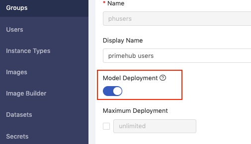
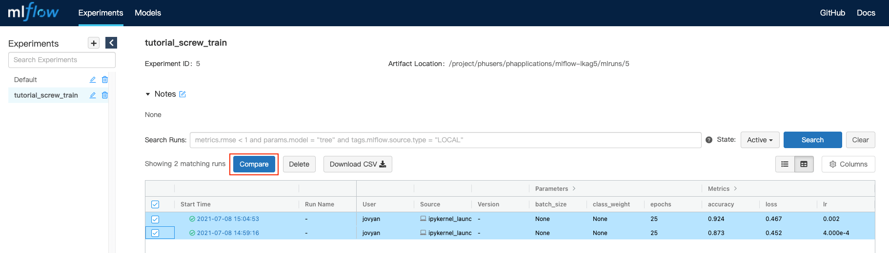
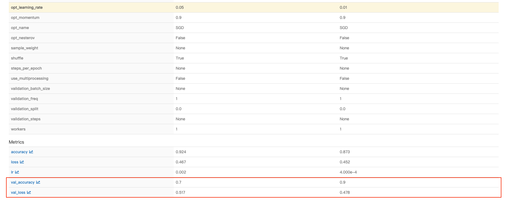
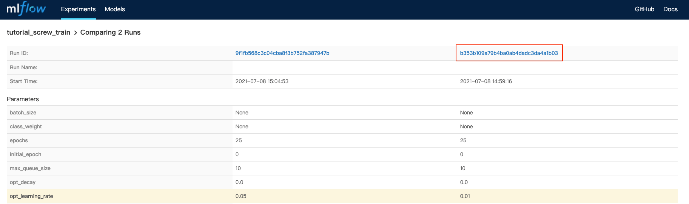
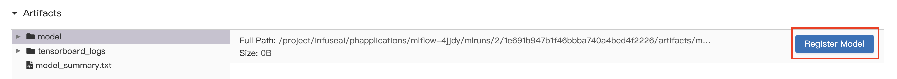
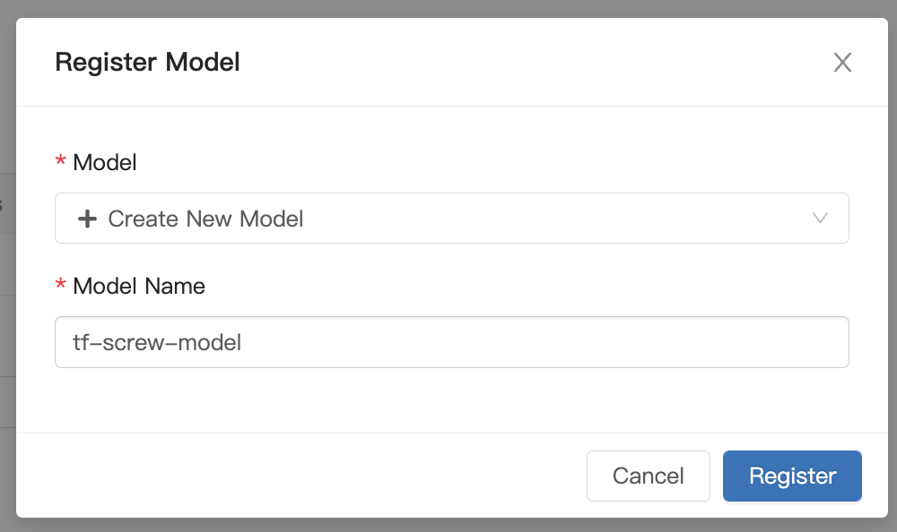
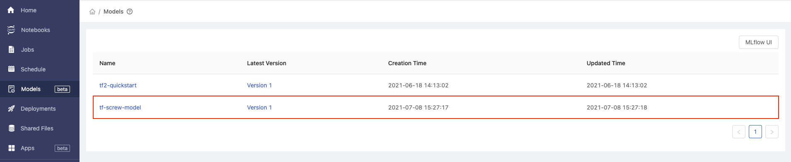
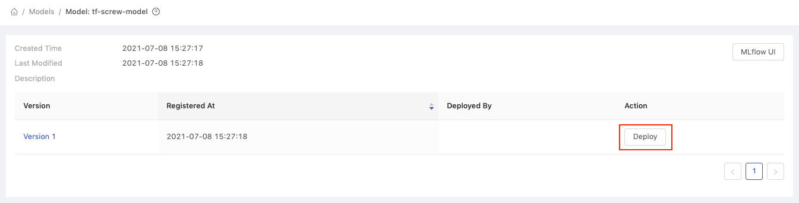
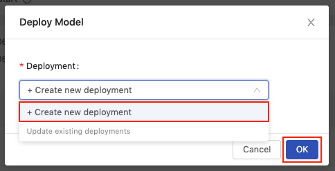

# 3 - Compare, Register and Deploy the Model

### Introduction

In the previous part, we used PrimeHub Notebook to train and manage the base model. In this part, we will:

1. Compare the results of these two experiment.
2. The experiment with the best performance will be registered in PrimeHub Models
3. Deploy as an online API service via PrimeHub's Model Deployment feature.
4. Use the command line to test the API service.

### Prerequisites

#### 1. Enable Model Deployment

Before we get started, enable the Model Deployment toggle in your group settings.

<figure><figcaption></figcaption></figure>

#### 2. Model pre-package docker image

There are two methods to get your pre-package docker image:

1.  You can use our model pre-package docker image:

    Image Name: `infuseaidev/tensorflow2-prepackaged:screw-classification`
2. You can [build your own pre-packaged docker image](../user-guide/advanced/custom-build-the-seldon-server.md) by followed the advanced guide.

### Step 1: Compared and Register the model

#### 1. Compare the model in the MLFlow server

To compare the results, click the checkbox next to each run to select them, then click the **Compare** button.

→ MLFlow server UI → Choose two runs → Click Compare.

<figure><figcaption></figcaption></figure>

#### 2. Choose the best run and register the model

Check the best score in Metrics

<figure><figcaption></figcaption></figure>

At the top of the page, click the **Run ID** link for the run.

<figure><figcaption></figcaption></figure>

In the Artifact, register the model folder as our model registry.

<figure><figcaption></figcaption></figure>

Enter the model information to register the model.

<figure><figcaption></figcaption></figure>

### Step 2: Deploy and test the model service

#### 1. Model Deployment

On the **Models** page in the PrimeHub user portal, click our managed model with the name **tf-screw-model**.

<figure><figcaption></figcaption></figure>

The following page shows all versions of the **tf-screw-model** model. Click the **Deploy** button for **Version 1**.

<figure><figcaption></figcaption></figure>

In the **Deploy Model** dialog, select **Create new deployment** from the **Deployment** dropdown and then click **OK**.

<figure><figcaption></figcaption></figure>

Fill in the Deployment information:

| Variable        | Value                                                 |
| --------------- | ----------------------------------------------------- |
| Deployment Name | tf-screw-deployment                                   |
| Model image     | infuseai/tensorflow2-prepackaged:screw-classification |
| InstanceTypes   | CPU 1                                                 |

Click the **Deploy** button, and you will be redirected to the **Deployments** page.

To view the details of the deployment, click the **tf-screw-deployment** card.


If you want to build your custom deployment logic and environment, you can see the information in the [advanced tutorial section](../user-guide/advanced/custom-build-the-seldon-server.md).


#### 2. Test the model service is available to use

Run the following command line:

```bash
curl -F 'binData=@data/arrange/val/good/000.png' <primehub-deploy-url>
```

You can get the output result:

```bash
{"data":{"names":["t:0"],"tensor":{"shape":[1,1],"values":[2.065972089767456]}},"meta":{"requestPath":{"model":"infuseai/tensorflow2-prepackaged:screw-classification"}}}
```

### Conclusion

In this tutorial, we compared and selected a suitable model using MLflow, deployed a model, and tested the model with sample data.

### Next Section

In the next article, we will add a web application interface to our model using Streamlit, another app available through PrimeHub Apps.
