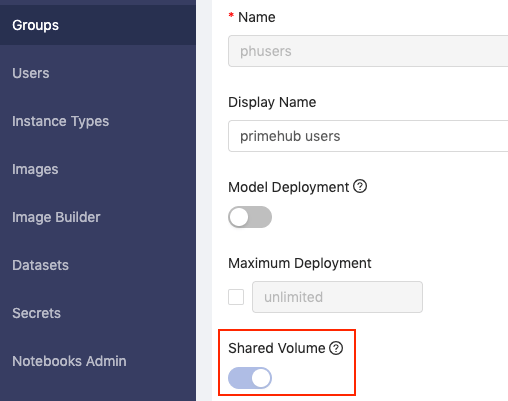

# Quickstart

### PrimeHub in 1 minute


PrimeHub in 1 minute


### Brief

In this quick-start, we will learn how to use a Notebook to train/generate a simple model. Then, in the follow-up guide, we will learn how to submit a parameter-tuning job for the model tuning from same Notebook.

* **Notebook** is a fundamental feature of Community/Enterprise editions.

### Training a model on Notebook

#### What we need?

* Select a group with Shared Volume enabled.

<figure><figcaption></figcaption></figure>

#### Steps

1.  **Open TensorFlow Notebook** from the Home page, then you will be redirected to the Notebooks page.

    <figure><figcaption></figcaption></figure>
2.  Click on **Start Notebook** to spawn a notebook with basic settings. If you want to use different instance types, click on **Change Settings** and start the notebook.&#x20;

    <figure><figcaption></figcaption></figure>
3.  Wait for the notebook spawn. When the notebook is ready, you will be redirected to the notebook with prepared example notebook.

    <figure><figcaption></figcaption></figure>

    <figure><figcaption></figcaption></figure>
4.  **Run All Cells**, it will train a classification model for MNIST dataset and save it.

    <figure><figcaption></figcaption></figure>

So far, we have trained and generated a model file via our Notebook. This is achievable in both Community and Enterprise editions of PrimeHub.

The next stage, _parameter-tuning job_, is for Enterprise users. Keep your Notebook environment open, and let's continue on...

### What's Next?

As Enterprise users we want to verify the performance of our model, in order to do this we can deploy the model as a service and query the it with test data.

* Quick-start: PrimeHub Model Deployment

### Reference

* Submit a Notebook as a Job
* Jobs Submission
