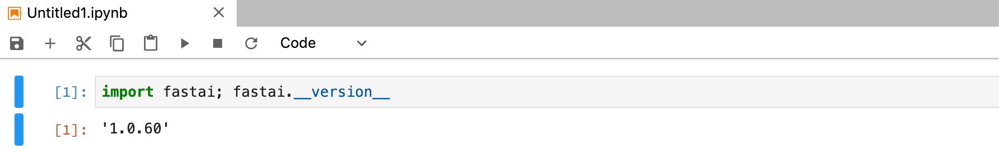

# Add Image

**Image**, is a working environment for an instance, we could have pre-built suitable images from public/private registries. We could even build our own images with customization and push to our registry by building customer. Here is a reference, Custom Image Guideline, describing which official registries we can pull images from and how we build our own ones.

This quick-start shows how we add an pre-built image on PrimeHub for users who can choose it for launching an instance on PrimeHub. If you haven't built any custom image, here is the [\[quickstart\] build image](build-image.md). Here we are going to add that custom image which is installed with `fastai v1 library` on PrimeHub.

### Let's Add Image

1. Log in as an administrator and [switch to Admin Portal](./).
2. Enter `Images` management and click `+ Add` for adding an image spec.
3. Fill `Name` with `gcr-fastai-v1`.
4. Select `Type` `cpu`.
5. Fill `Container image url` with the url of our custom image. E.g. `gcr.io/infuseai/fastai-v1:1d1bxxxx`.
6. Since we put our image on `Google Container Registry` (_It varies according to your real circumstance._), it requires a pull-secret to pull down the image, we check off `Usage Image Pull Secret` and select the right `secret`.
7. Enable `Global` to make it available to all of users.
8. Click `Confirm` to save the setting.

Now users can select this custom image when launching an JupyterHub instance, once the jupyterhub is launched, we can check the `fastai` library version in a notebook.

<figure><figcaption></figcaption></figure>

#### Alternative

We, of course, can add an image which is located on public registry without a pull-secret; using url `jupyter/tensorflow-notebook` at step 5 instead and leave `Use Image Pull Secret` unchecked.

### Next

By far, we have created users, groups, instance types and added images, users are ready to launch a JupyterHub instance. Next, we can go further to try custom build images.
