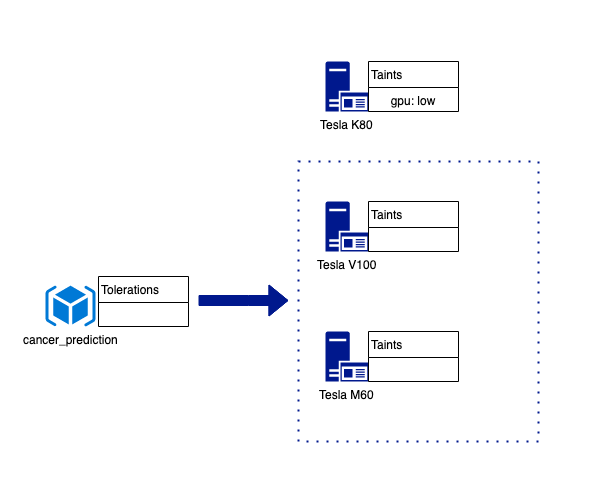
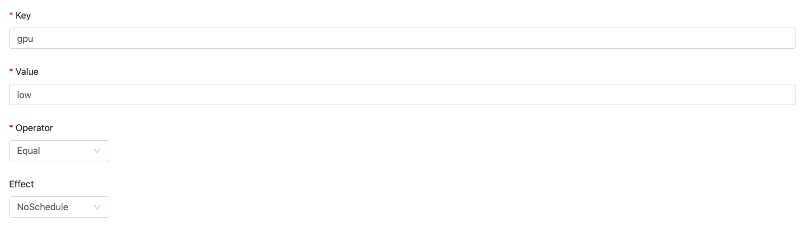
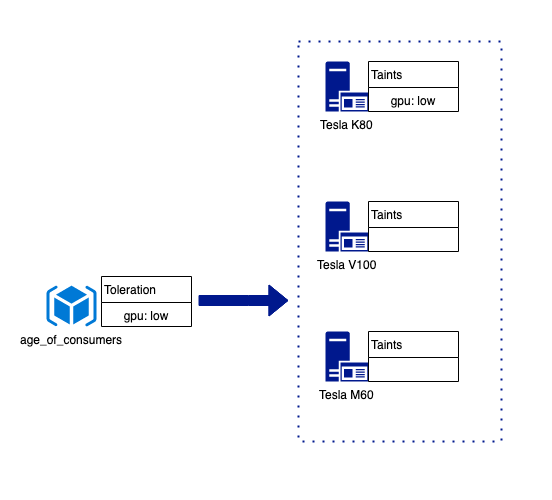

# Toleration

In a real circumstance, we may have multiple nodes with varied performance of GPUs. Let's say we have `Nvidia Tesla V100(high)`, `Tesla M60(Medium)` and `Tesla K80(Low)` and we know there is a project using the instance type (_cancer\_prediction_) which requires GPU Tesla M60 and above. In this case, we can taint nodes which have GPU Tesla K80.

```
kubectl taint nodes node1 gpu=low:NoSchedule
```

Then a project spawned from _cancer\_prediction_ is only scheduled on nodes which have Tesla V100(High) or Tesla M60(Medium).

<figure><figcaption></figcaption></figure>

Meanwhile, we have a project using the instance type (age\_of\_consumers) demanding much less GPU performance, in other words, it can accept/tolerate GPU of low performance, of course, it is much better if GPU of higher performance is available. In this case, we add a **Toleration** by editing Instance Type on Admin UI.

<figure><figcaption></figcaption></figure>

So the project is able to be scheduled not only on nodes with GPU(high/Medium) but also on nodes with GPU(low).

<figure><figcaption></figcaption></figure>
