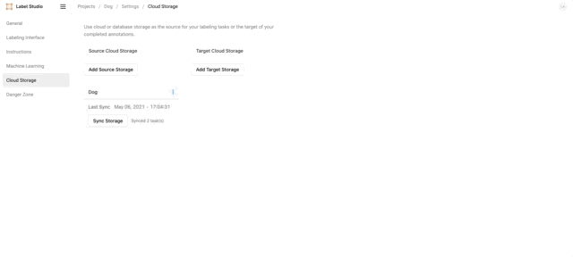

# Label Dataset by Label Studio

This tutorial covers the basic flow to help you get started with Label Studio in PrimeHub.

### Install Label Studio

First, you need to install it in the `Apps` tab. Please check the Overview section to learn how to install an App.

In the installing process, you can change the environment variables.

`DEFAULT_USERNAME` and `DEFAULT_PASSWORD` are the login account information. You can change them and use them to log into Label Studio after installed.

If you don't know the meaning of other environment variables, you can use the default values or check the [Label Studio Official Doc](https://labelstud.io/guide/start.html#Command-line-arguments-for-starting-Label-Studio) or the tooltip beside the environment variable for more details.

### Label Studio UI

PrimeHub shows the app's state in the `Apps` tab. You can open the Label Studio UI by clicking `Open` after the state becomes `Ready`.

<figure><figcaption></figcaption></figure>

It will open a new window and show the Label Studio UI. You can find your login information by clicking `Manage` in the `Apps` tab and then clicking the eyes icon. The `$(PRIMEHUB_GROUP)` is the group name.

<figure><figcaption></figcaption></figure>

### Label Dataset

#### What we need?

* The dataset in PrimeHub you want to label (we use `/datasets/dog-demo` in this tutorial)
* The directory in group volume that you want to save the labeled results (we use `/project/<group_name>/dog-demo-labeled` in the tutorial)


Please have the data volume, group volume, or request administrators for assistance before we start.


#### Steps

1.  After login, please click `Create` button.

    <figure><figcaption></figcaption></figure>
2. Enter your `Project Name`. Skip the `Data Import` step. And choose the `Labeling Setup`. Here we choose `Semantic Segmentation with Polygons`.
3.  Delete the original `Labels` settings and `Add` our own label names.

    <figure><figcaption></figcaption></figure>
4.  Click the `Settings` on the upper-right. Click `Cloud Storage` and `Add Source Storage` to sync the `/datasets/dog-demo` data volume to label. You need to set `Local path` to `/datasets/dog-demo`, turn on toggle of `Treat every bucket object as a source file` and click `Sync Storage`\
    \`\`

    <figure><figcaption></figcaption></figure>
5.  Click `Add Target Storage` to sync to labeled results to `/project/<group_name>/dog-demo-labeled`. You need to set `Local path` to `/project/<group_name>/dog-demo-labeled`.

    <figure><figcaption></figcaption></figure>
6.  Back to the project in Label Studio. The data in the data volume has been shown on the UI. And you can click each row of data to label.

    <figure><figcaption></figcaption></figure>

    <figure><figcaption></figcaption></figure>
7.  After you submit the labeled result, the labeled json file will be under the `/project/<group_name>/dog-demo-labeled`.

    <figure><figcaption></figcaption></figure>

That's the basic use of how to label the dataset by using Label Studio and PrimeHub. Enjoy it!

### How to Use Labeled Data to Train a Model

In the last section, we show you how to label the dataset. Now, we want to demonstrate how you can use the labeled data to train a model.

For simplicity, the model will be a classification model and you also only need to label the class of the image. The model classifies whether the screw is good or bad.

Here are examples of good and bad screws. The first image is the good screw. The second image is the bad screw and you can see the there is a manipulated front.

<figure><figcaption></figcaption></figure>

<figure><figcaption></figcaption></figure>

#### What we need?

* Create a [data volume](../../../administrator-guide/volume-management/#creating-new-volume) in PrimeHub called `screw`, and set the read/write permission to your group. Please download the _app\_tutorial\_labelstudio\_screw\_dataset.zip_, unzip it and upload images to the `~/datasets/screw` folder by the notebook
* Create a directory `/project/<group_name>/screw-labeled` in group volume to save the labeled results
* The image `infuseai/docker-stacks:pytorch-notebook-v1-7-0-04b2c51f`
* An instance type >= minimal requirement (CPU=1, GPU=0, Mem=2G)
* The prepared python file of the example _app\_tutorial\_labelstudio\_screw\_prepare.py_ and upload it to `~/screw_train` by the notebook
* The prepared notebook file of the example _app\_tutorial\_labelstudio\_screw\_train.ipynb_ and upload it to `~/screw_train` by the notebook








Please have the data volume, group volume, or request administrators for assistance before we start.



To use the new data volume, you need to create a label studio app **after** the creation of the data volume.


#### Steps

1. Follow the previous `Label Dataset` section to use the label studio. This time in `Labeling Setup`, we should choose `Image Classification`.
2.  Delete the original `Labels` settings and `Add` our own label classes: `bad`, `good`.

    <figure><figcaption></figcaption></figure>
3. Click the `Settings` on the upper-right. Click `Cloud Storage` and `Add Source Storage` to sync the `/datasets/screw` data volume to label. Set `Local path` to `/datasets/screw`, set `File Filter Regex` to `.*png`, turn on toggle of `Treat every bucket object as a source file`. After added, click `Sync Storage`.
4. Click `Add Target Storage` to sync to labeled results to `/project/<group_name>/screw-labeled`. You need to set `Local path` to `/project/<group_name>/screw-labeled`.
5.  Back to the project in Label Studio. The data in the data volume has been shown on the UI. And you can click `Label` to start labeling. (Tip: you can use number to select the class)

    <figure><figcaption></figcaption></figure>

    After you labeled all images, you may see the following message. This is a known issue. Please click `OK`, click your project name and refresh the page.

    <figure><figcaption></figcaption></figure>
6. Now you have labeled all data by the label studio. We can go back to our notebook to train the model.
7.  Open a terminal.

    ```bash
      cd ~/screw_train
      python app_tutorial_labelstudio_screw_prepare.py --path /project/<group_name>/screw-labeled/
    ```

    After executed, it will create a folder named `data` and place the labeled images into the correct folder inside `data` folder.
8. Open the notebook `app_tutorial_labelstudio_screw_train.ipynb` and execute all cells. In the last cell, you will see the result which is similar to the following image. .png>)

We successfully use our labeled data to train a model which can classify whether the screw is good or bad!
