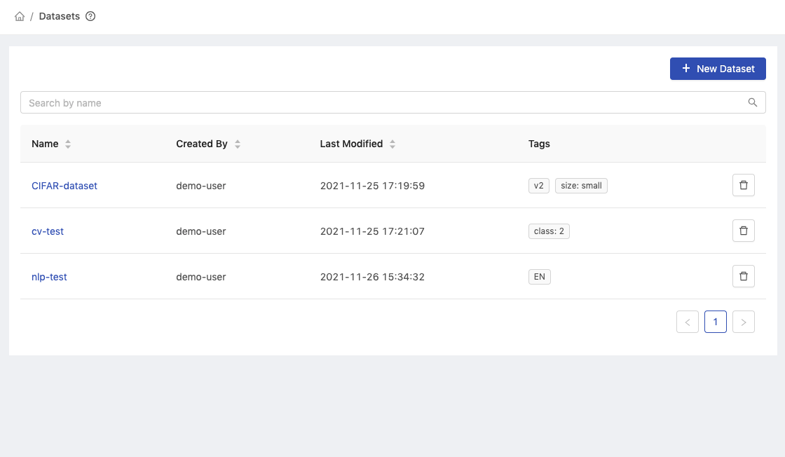
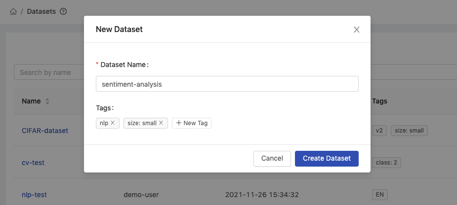
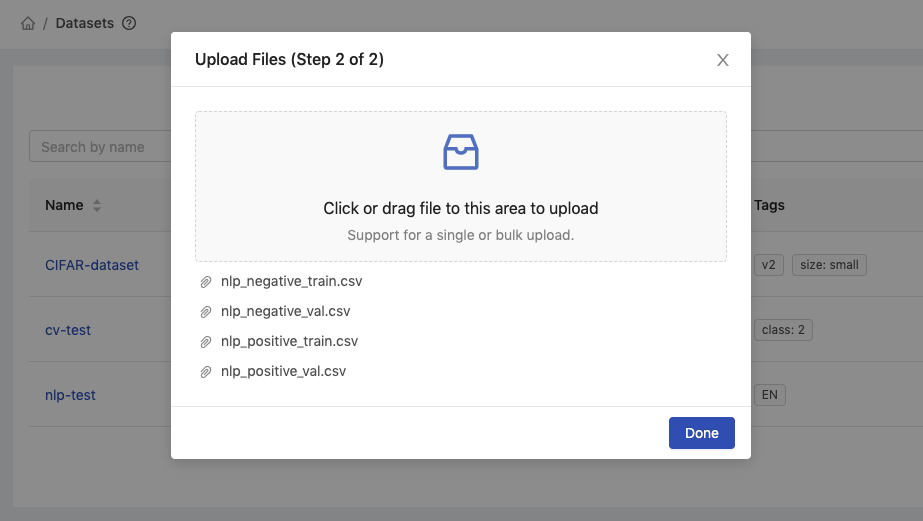
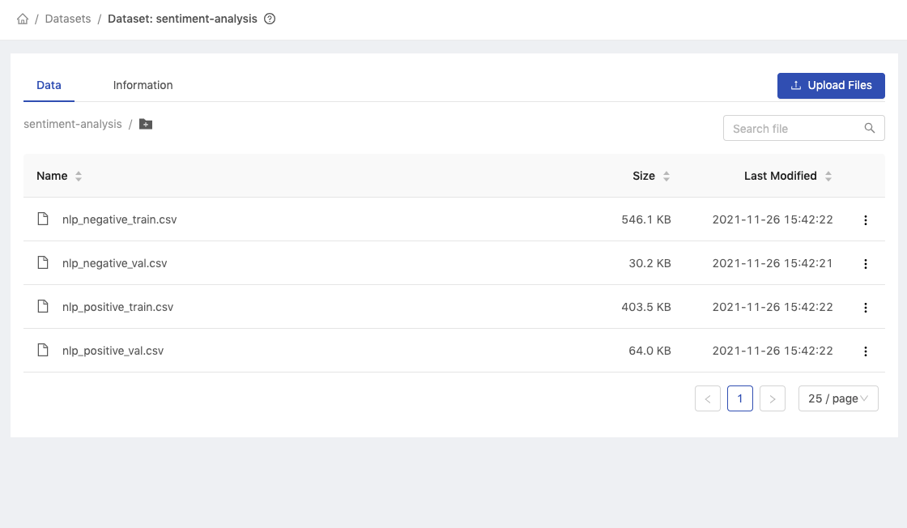
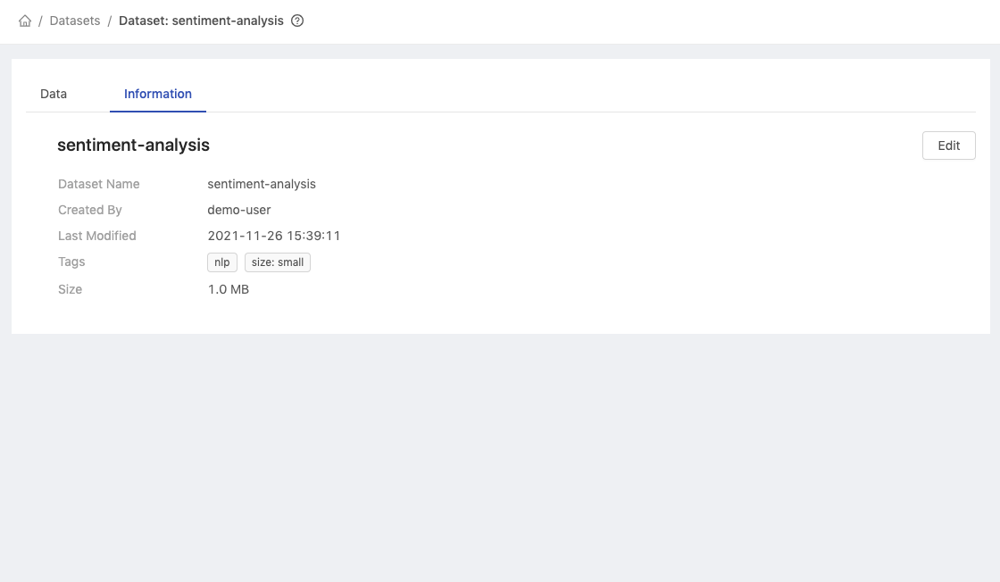
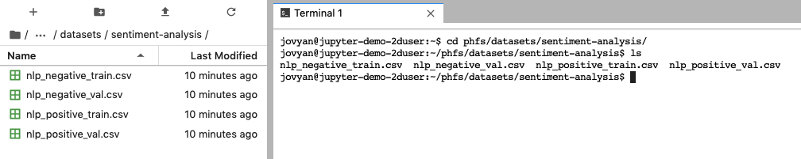
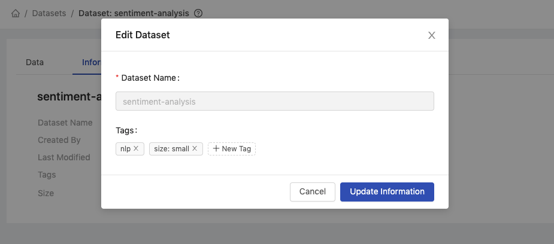
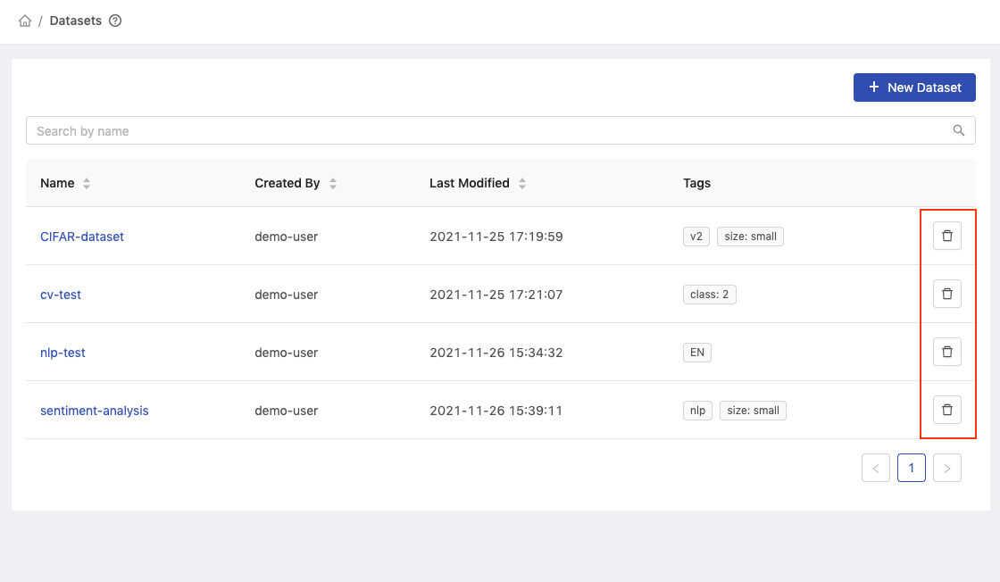

# Datasets

Datasets feature provides the capabilities of managing datasets resources such as create, update, and delete actions.

Datasets feature is based on [Shared Files](shared-files.md) to store dataset files with additional metadata. Group members can browse dataset files and upload files for sharing with other group members.

### Prerequisites

Datasets feature is only enabled if [PHFS](../../technology/design/primehub-file-system-phfs.md) is enabled.

### Creating New Dataset

<figure><figcaption></figcaption></figure>

Click `New Dataset` to add a dataset and it will pop up the dialog of **New Dataset**.

#### Step 1: Name and Tags

<figure><figcaption></figcaption></figure>

* `Dataset Name`: Name of the dataset (only the alphanumeric characters, hyphen `-`, or underscore `_` are allowed).
* `Tags`: Tags for the dataset.

#### Step 2: Uploading Files

<figure><figcaption></figcaption></figure>

Click or drop files to start uploading files. Once the files are uploaded, they will appear in the list of files.

Click `Done` to finish the upload.

<figure><figcaption></figcaption></figure>

All uploaded files are stored in the dataset.

### Browse Dataset

#### Dataset List

<figure><figcaption></figcaption></figure>

* `Name`: Name of the dataset.
* `Created By`: User who created the dataset.
* `Last Modified`: Last modified time of the dataset.
* `Tags`: Tags for the dataset.
* `Delete button`: Delete the dataset.

#### Dataset - Data Tab

The **Data** tab shows the list of files in the dataset.

<figure><figcaption></figcaption></figure>

#### Dataset - Information Tab

<figure><figcaption></figcaption></figure>

* `Dataset Name`: Name of the dataset.
* `Created By`: User who created the dataset.
* `Last Modified`: Last modified time of the dataset.
* `Tags`: Tags for the dataset.
* `Size`: Size of the dataset.
* `Edit button`: Edit the dataset.

### Access from Jupyter

<figure><figcaption></figcaption></figure>

Open a Notebook and access the dataset from the path of `phfs/datasets/<dataset_name>`.

### Editing Dataset

<figure><figcaption></figcaption></figure>

Go to the **Information** tab and click `Edit` to edit the dataset.

### Deleting Dataset

<figure><figcaption></figcaption></figure>

In the **Datasets** list, click `Delete` button to delete the dataset.
