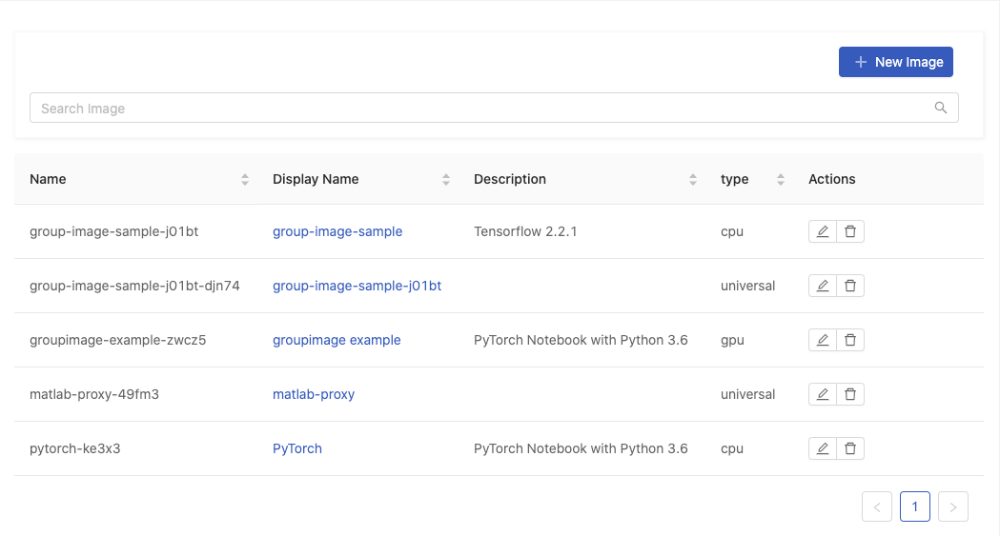
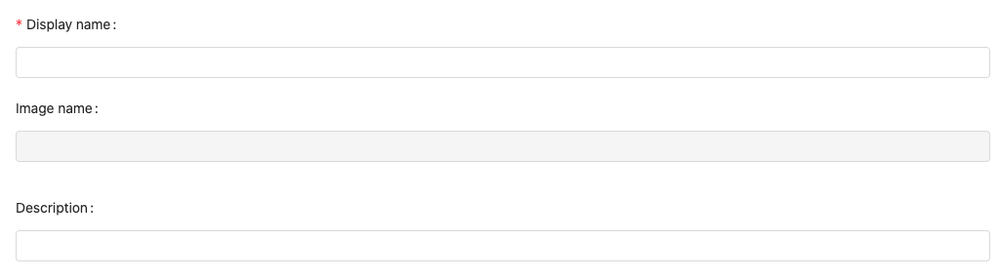
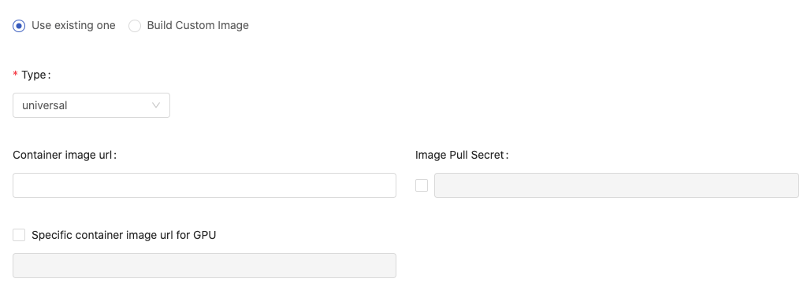
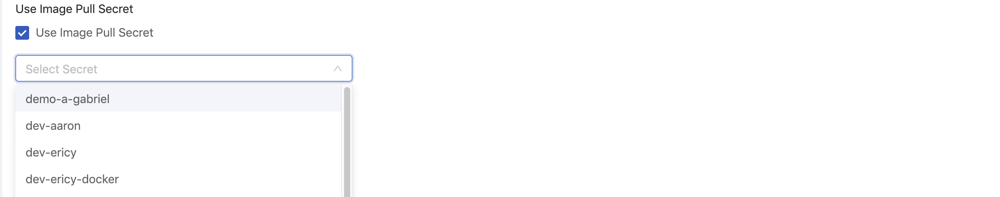
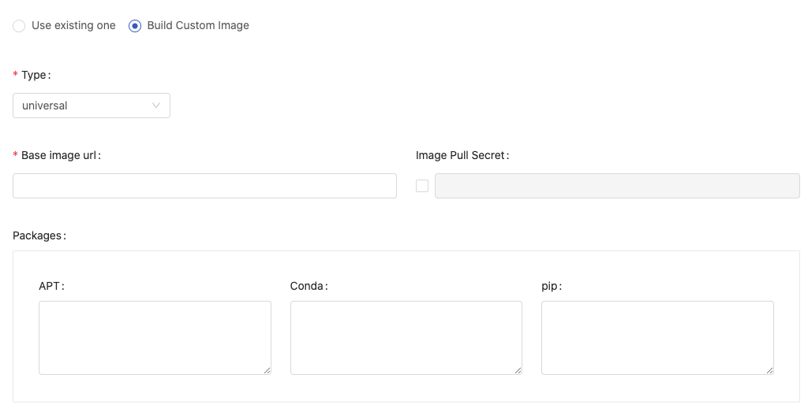
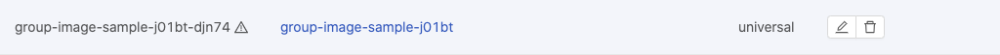
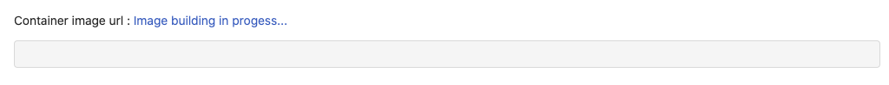
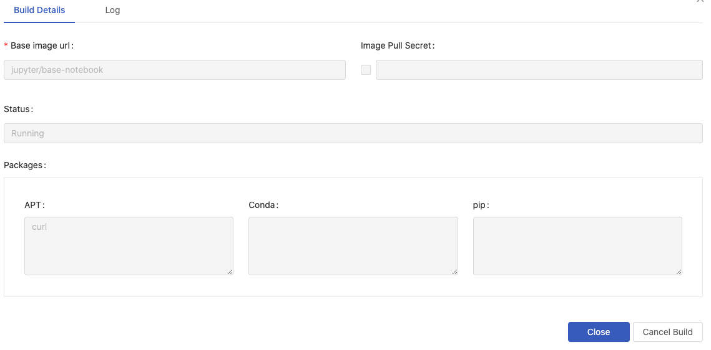
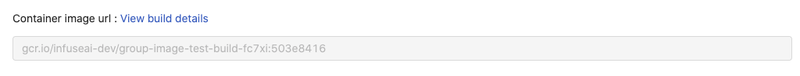
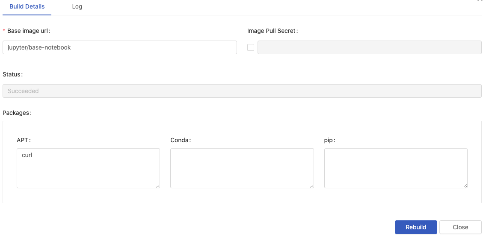

# Images

**Images** is a feature that _Group Admin_ can manage images for the managed group. Only group members can access these group-specific images from the image selection when it is required.


Images is a feature dedicated to [Group Admin](../../../technology/concept/privilege.md#group-administrator); only Group Admin can access it from User Portal. Please contact Admin to acquire Group Admin privilege.


<figure><figcaption></figcaption></figure>

* `Search Image`: Search images by a keyword and press Enter.

### Add New Image

Click `New Image` to add an Image.

<figure><figcaption></figcaption></figure>

* `Display name`: (required): Only lowercase letters, numbers, hyphen `-` and a dot `.` can be filled in.
* `Image name`: an auto-generated name based on Display name.
* `Description`

Choose `Use existing image` or `Build custom image`.

### Use Existing Image

Add an existing image for the group.

<figure><figcaption></figcaption></figure>

* `Type`: `cpu`, `gpu` and `universal`: Select what type of the image is.
* `Container image url`: Fill in the Image's url. See [Reference](../../../reference/infuseai-images-list.md).
*   `Image Pull Secret` Enable and select the secret if a pull-secret is required.

    <figure><figcaption></figcaption></figure>
* `Specific container image url for GPU` It appears when `universal` is selected. By default, it uses the same url as container image url. Enable it if a specific image url for GPU is desired.

Click `Create` to complete the addition.

### Build Custom Image

Instead of adding existing images, Group Admin can build custom images and add them for the group.

<figure><figcaption></figcaption></figure>

* `Type`: `cpu`, `gpu` and `universal`: Select what type of the image is.
* `Base image url` (required) The url of the base image; we can use any valid image URLs or we can choose images which are added via Image Management from autocompletion. See [Reference](../../../group-administration/broken-reference/).
* `Image Pull Secret` Enable and select the secret if a pull-secret is required.
*   `Packages` choose packages installer/management and fill in packages requirement.

    * `APT` Packages management of Debian, Ubuntu and related Linux distribution.
    * `Conda` A packages management supports multiple programming language. [Ref.⇗](https://docs.conda.io/projects/conda/en/latest/user-guide/tasks/manage-pkgs.html#installing-packages)
    * `Pip` Using python packages installer. [Ref.⇗](https://packaging.python.org/tutorials/installing-packages/#use-pip-for-installing)

    > In case of multiple packages, please using the **line break** for each package instead of putting them in one line.

Click `Create` to start the building.

#### Conda Package Match Specification

Conda supports to specify `channel` where the package is sourced from and [match specification](https://docs.conda.io/projects/conda-build/en/latest/resources/package-spec.html#package-match-specifications) of the package. So we can specify images more specifically.

The syntax is

```
(channel(/subdir):(namespace):)name(version(build))[key1=value1,key2=value2]
```

For example, to install `numpy` package which is sourced from the channel, **conda-forge**, [Ref.⇗](https://anaconda.org/conda-forge/numpy).

Use `-c conda-forge::` to specify the channel:

```bash
-c conda-forge::numpy==1.17*
```

***

#### Building in progress

While building, the image name is amended with an triangular exclamation mark to indicate the image is not ready.

<figure><figcaption></figcaption></figure>

Click the image name to view the detail, it shows `Image building in progress` beside Container image url.

<figure><figcaption></figcaption></figure>

Click `Image building in progress` to view the `Build Details` and `Log` of the building.

<figure><figcaption></figcaption></figure>

The building progress can be cancelled by `Cancel Build`.

#### View build details and Rebuild

Once the building finishes successfully, there is no triangular exclamation mark as a postfix to the image name. The image becomes available from image selection.

<figure><figcaption></figcaption></figure>

Click `View build details` to view the detail and logs or to modify the detail for rebuilding.

<figure><figcaption></figcaption></figure>

To rebuild a image, by modification to the details and pressing `Rebuild`.

### Group Image

Whether adding an existing image or building a custom image for the managed group, the image can be selected from image selection; `i` hint indicates a `Group` image.

<figure><figcaption></figcaption></figure>
