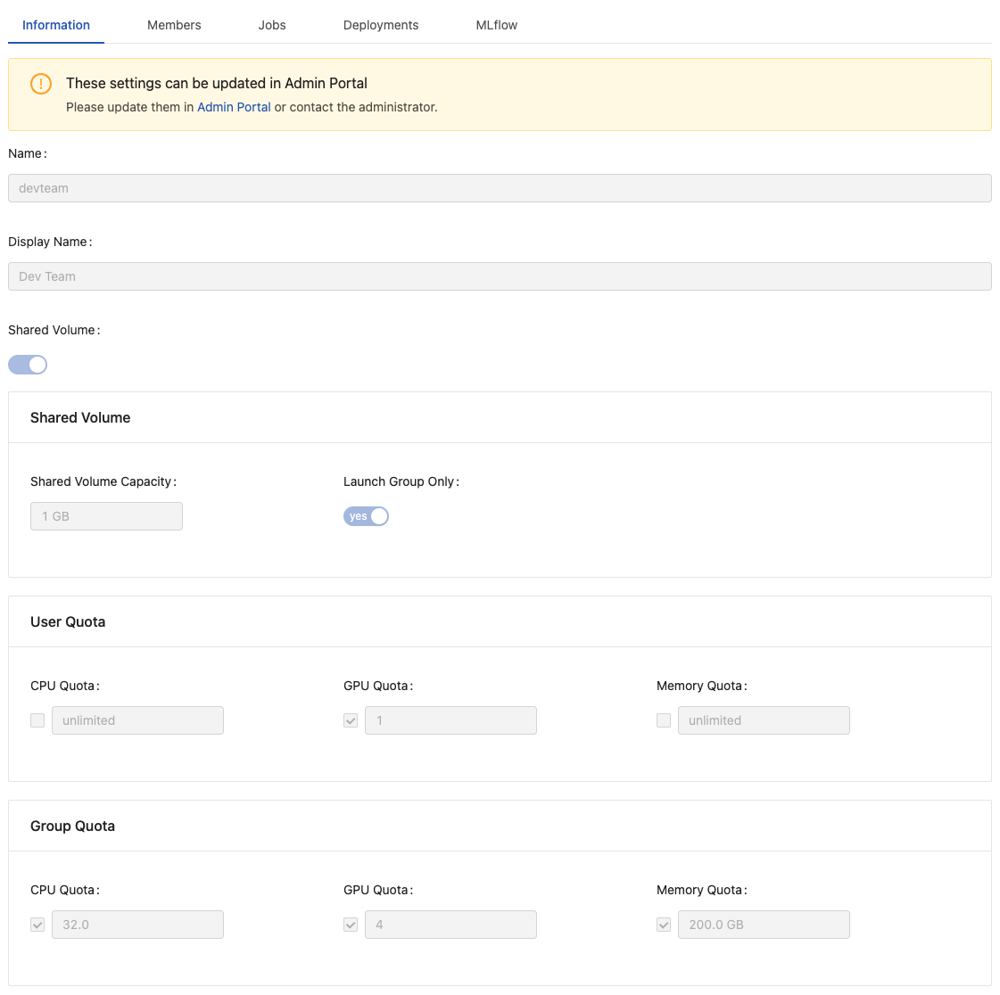
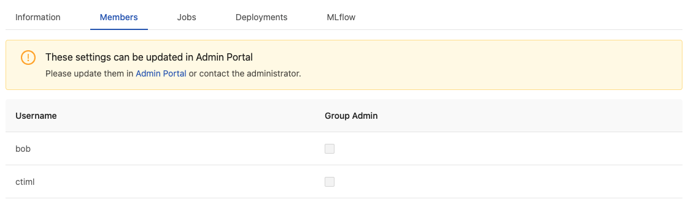
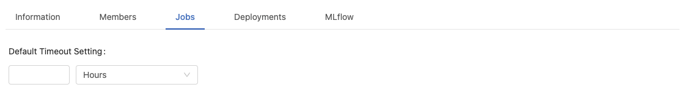
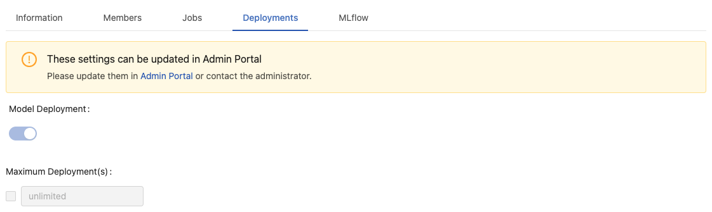
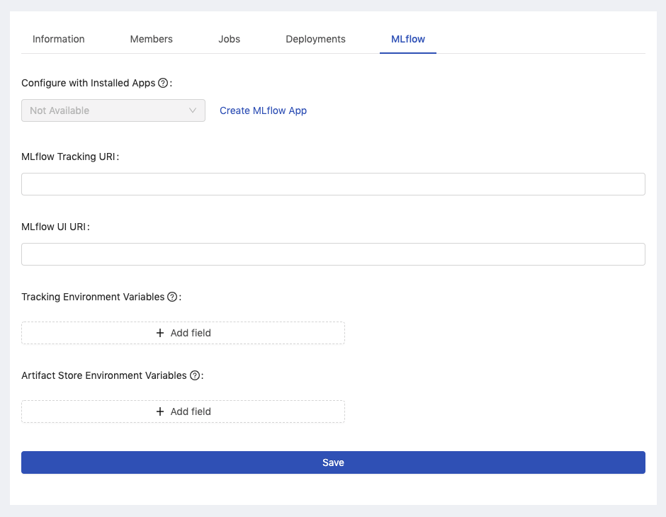
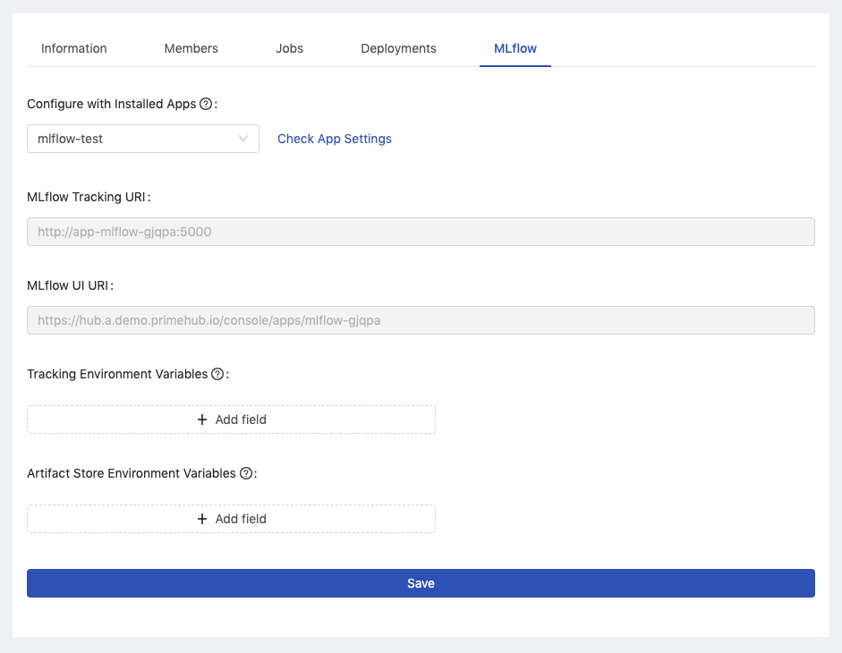

# Settings

Group Admin can view the current settings of the managed group which are configured by Platform Administrator. All of settings are viewable-only to Group Admin, except **Default Timeout Setting** of Jobs is configurable.


In order to change viewable-only settings, please request Platform Administrator.


### Info

<figure><figcaption></figcaption></figure>

It displays the current settings, **Name**, **Display Name**, **Shared Volume**, **User Quota** and **Group Quota** of the working group.

### Members

<figure><figcaption></figcaption></figure>

It displays group members and group administrators.

### Jobs

<figure><figcaption></figcaption></figure>

* `Default Timeout Setting`: Set Minutes / Hours / Days.

Group Admin can apply a group-wise Job timeout setting on every jobs submitted from the group. A running job will be cancelled when it exceeds the setting. This setting is able to be overwritten by each job submission for the customization. By default it is 7 days.

### Deployments

<figure><figcaption></figcaption></figure>

It displays if **Model Deployment** is enabled to the group, i.e., if the group can use **Deployments** feature.

### MLflow

PrimeHub provides _Models_ feature by integrating with MLflow app instance. We can easily set up the MLflow app in the following steps:

1.  Click `Create MLflow App` link to create the MLflow app.

    <figure><figcaption></figcaption></figure>
2.  After the MLflow app is successfully created, we can choose it from the `Configure with Installed Apps` selector. Both the required information `MLflow Tracking URI` and `MLflow UI URI` will be automatically filled.

    <figure><figcaption></figcaption></figure>
3. Click `Save` button to keep the setting for binding Models to the MLflow instance.

Furthermore, if we have another installed MLflow app instance, then we can learn `App URL` and `Service Endpoint` from the installed App detail.

* Fill in `MLflow Tracking URI` with `http://`+`Service Endpoint`.
*   Fill in `MLflow UI URI` with `App URL`.

    <figure><figcaption></figcaption></figure>


By integrating externally-hosted MLflow server, see [Configuration](../../developer-guide/configuration/configure-model-deployment.md) for the detail.

