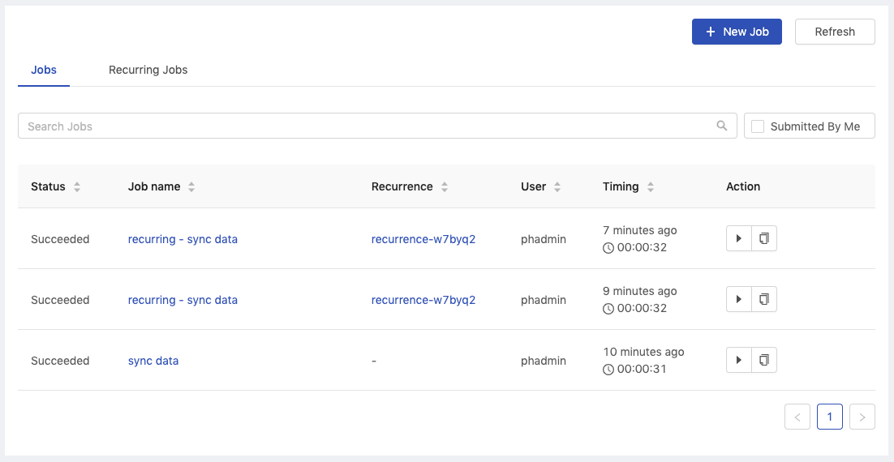
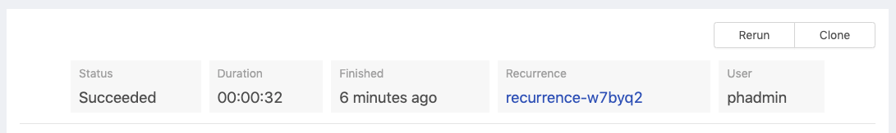
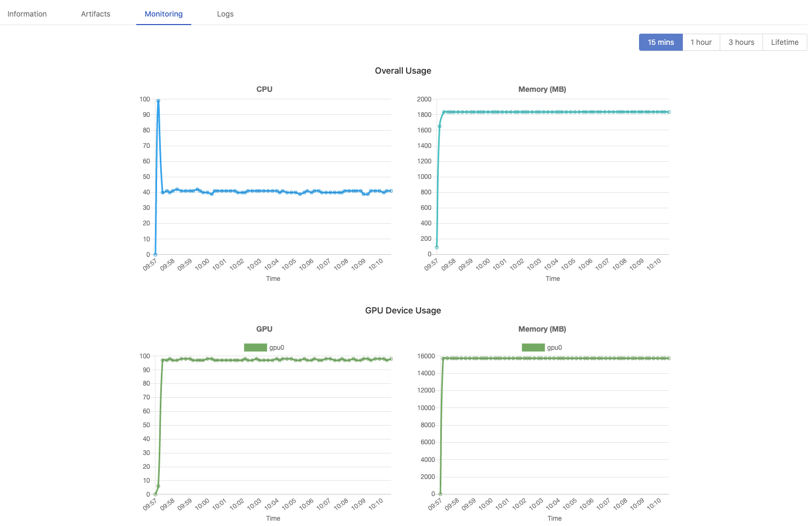
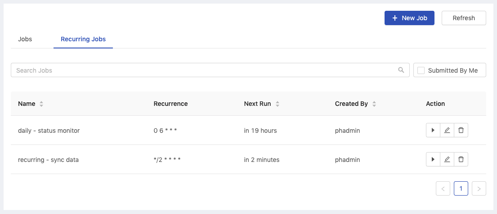
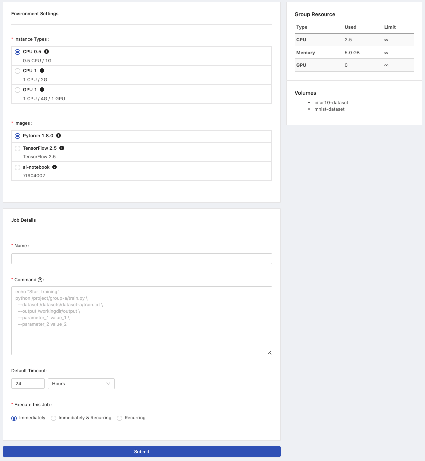
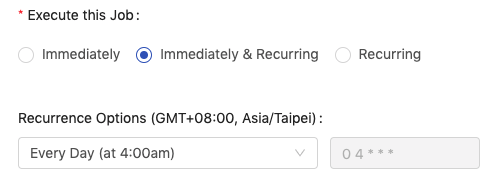

# Jobs/Recurring Jobs

We sometimes have time-consuming tasks which have to be run sequentially, because tasks take considerable time to complete, users are not able to engage with the whole of the progress.

In this case, we can use **Jobs** to create a job of sequential multiple tasks and submit the job for execution in the background, meanwhile, we can monitor the progress from the log.

In addition to the **Jobs**, PrimeHub also provides another feature, **Recurring Jobs** that we can create recurring jobs which are responsible for submitting jobs regularly according to the recurrence settings.

### Jobs

#### Jobs List

There is a list showing created jobs within the current group with relevant information.

<figure><figcaption></figcaption></figure>

| Column       | Description                                                                                                |
| ------------ | ---------------------------------------------------------------------------------------------------------- |
| `Status`     | The status of the job. `Pending`,`Preparing`, `Running`, `Failed`, `Succeeded`, `Cancelled` and `Unknown`. |
| `Job name`   | The name of the job.                                                                                       |
| `Recurrence` | The name of the job recurrence if the job is triggered by the recurring job, otherwise it shows `-`.       |
| `User`       | The owner who submits the job.                                                                             |
| `Timing`     | The duration of the running job.                                                                           |
| `Action`     | The action buttons, `Cancel`, `Rerun`, `Clone`.                                                            |

* `New Job` button: Click the button to create the job.
* `Refresh` button: Click the button to refresh the list.
* `Job name` link: Click the name to enter the job detail page.
* `Recurrence` link: Click the name to enter the detail page of recurring job if any.
* `Submitted by Me` if checked off, it lists jobs **ONLY** submitted by the user.
* `Search Jobs` search by the Job name.

#### View Job

Click the job name on the list to view the job information and logs. The job can also be `Rerun` or `Clone` into a new job.

**Panel**

It shows the brief information of the job.

<figure><figcaption></figcaption></figure>

| Field        | Description                                                                                                                          |
| ------------ | ------------------------------------------------------------------------------------------------------------------------------------ |
| `Status`     | The status of the job. `Preparing`, `Running`, `Failed`, `Succeeded`, `Cancelled` and `Unknown`.                                     |
| `Duration`   | The duration of the job running.                                                                                                     |
| `Finished`   | How much time ago the job finished.                                                                                                  |
| `Recurrence` | The name of the recurring job if the job is triggered by the scheduler; clicking the name to enter the detail page of recurring job. |
| `User`       | The owner who submits the job.                                                                                                       |

**Tabs**

<figure><figcaption></figcaption></figure>

**Information**

Here are the detail information of the job:

| Field           | Description                             |
| --------------- | --------------------------------------- |
| `Message`       | Messages returned from job running.     |
| `Job ID`        | The unique id of the job.               |
| `Job name`      | The name of the job.                    |
| `Creation Time` | The time the job is created at.         |
| `Start Time`    | The time the job starts at.             |
| `Finished Time` | The time the job finishes at.           |
| `Group`         | The group where the the job belongs to. |
| `Instance type` | The instance type which the job uses.   |
| `Image`         | The image which the job run based on.   |
| `Command`       | The context of the job.                 |

**Artifacts**

If a Job generates data so called **artifacts** under the [PHFS storage](../../../technology/design/primehub-file-system-phfs.md) `artifacts/` during the execution, here it lists those artifacts. Meanwhile, in Notebook, these artifacts are stored under `/phfs/jobArtifacts/job-xxxxx`. See the [simple usage of Job Artifacts](tutorial/job-artifacts-simple-usecase.md).

**Monitoring**


It shows the message "feature not enabled, please contact admin", if underlying prerequisite phfs is not enabled.


Monitoring indicates how much resources the Job use.

*   `15 mins`, `1 hour`, `3 hours`, `Lifetime`: Select the latest timespan of metrics; _15min_ shows metrics of the latest 15mins only, _Lifetime_ shows metrics from the beginning to the end. See The interval of data sampling per timespan.

    > View the average usage within these most recent time frames
* `Overall Usage`: CPU and Memory(MB).
* `GPU Device Usage`: GPU and Memory(MB) display _if GPU is allocated_.

<figure><figcaption></figcaption></figure>

**Logs**


Logs viewer lists latest 2000 lines only of logs; press `Download` for the complete log file.


When a job comes to success or failure, it logs the whole of job running progress. This is where we can check the progress, result or even shoot troubles if failed.

The log viewer here only list the latest 2000 lines of logs. Clicking `Scroll to Bottom` to check the last logs at the bottom or clicking `Download` to download a complete log file.

However, when a job comes to cancellation or timeout, **there is no log left** since the pod has been deleted.

***

### Recurring Jobs

#### Recurring Jobs List

There is a list showing created recurring jobs within the current group with relevant information.

<figure><figcaption></figcaption></figure>

| Column       | Description                                                        |
| ------------ | ------------------------------------------------------------------ |
| `Name`       | The name of the recurring job.                                     |
| `Recurrence` | The recurrence of the trigger if any.                              |
| `Next Run`   | Time when a job will be triggered next time.                       |
| `Created By` | The owner of the recurring job.                                    |
| `Action`     | The action buttons are `trigger`, `edit` and `delete` in sequence. |

* `New Job` button: Click the button to create the job.
* `Refresh` button: Click the button to refresh the list.
* `Submitted by Me` if checked off, it lists jobs **ONLY** submitted by the user.
* `Search Jobs` search by the Job name.

***

### Create Job/Recurring Job

Confirm if the current group is what you desire; switch the group by the `Group:` dropdown in the upper right corner.

<figure><figcaption></figcaption></figure>

* `InstanceTypes`: Select a instance type which allocates resources for the job.
* `Images`: Select an image which the job run bases on.
* `Name`: The name of the job.
* `Command`: The sequential commands of the job context.
* `Default Timeout`: `Minutes` / `Hours` / `Days`; a running job will be cancelled after the interval of time, the setting here will overwrite the setting from a Group.
* `Execute this Job`: `Immediately` / `Immediately & Recurring`/ `Recurring`; directly execute this job AND/OR create a regularly executed recurring job.
* `Submit`: Click the button to submit the job.

**Command**

Users are able to run `sudo apt <command>` in a Job.

such as

```
sudo apt update
sudo apt install <package> --assume-yes
pip install <package>
```

**Directories/paths the job can access if directories exits:**


**Notice**：The default working directory of a Job is under `/home/jovyan`; This is `/home/jovyan` inside Job Pod _rather than `/home/jovyan` inside Notebook_, therefore, _files locating at `/home/jovyan` of Notebook **don't exist** here_! There are `<group volume>` and `<data volume>` only mounted here in Job Pod.


| Directory                                                        | Description                                                                                                                                                                              |
| ---------------------------------------------------------------- | ---------------------------------------------------------------------------------------------------------------------------------------------------------------------------------------- |
| `/home/jovyan`                                                   | A **temporary working directory** while jobs running. _**Note**: saving data here will be lost when jobs finished._                                                                      |
| `/home/jovyan/<group> -> /project/<group>`                       | Using this path (or Symbolic link) to access a group volume, load files and save output persistently. _**Note:** a group volume is required, please consult administrators._             |
| `/home/jovyan/datasets/<data volume> -> /datasets/<data volume>` | Using this path (or Symbolic link) to access a data volume, load data volumes which connect to the group. _**Note:** a existing data volume is required, please consult administrators._ |

**Environmental variables:**

| Env Variable      | Description |
| ----------------- | ----------- |
| `$PRIMEHUB_USER`  | Job's owner |
| `$PRIMEHUB_GROUP` | Job's group |

**Python command option**

`python -u` we can use `-u` to force stdin, stdout and stderr to be totally unbuffered, so we can see logs in real time.

**Example 1**: There is a file, `train_mint.py`, stored in group volume, `research`, then we can execute the python file as a job like below. Since the python file is executed under `/project/research`, the data output by the job is saved under the path relatively.

```bash
cd /project/research/
python -u train_minst.py
```

**Example 2**: If we execute the job like below, the output data will be saved under `/home/jovyan` which is a _temporary_ directory while the job is running. In other words, data saved under `/home/jovyan` will be lost.

```bash
python -u /project/research/train_minst.py
```


We, sometimes, may find ourselves repeating frequently-used packages installation in every runtime. Either we can request Group admin/Admin to build a custom image with those packages to avoid the repetition or we can customize own runtime environments at our convenience. See Reference.


**Execute this Job**

<figure><figcaption></figcaption></figure>

| Options                   | Description                                                                                |
| ------------------------- | ------------------------------------------------------------------------------------------ |
| `Immediately`             | The job will be executed immediately.                                                      |
| `Immediately & Recurring` | The job will be executed immediately and will be scheduled according to user's preference. |
| `Recurring`               | The job will be scheduled according to user's preference.                                  |

The `Recurrence Options` is the rule of trigger recurrence. We can select one of presets of rules or customize a rule based on [Cron syntax](https://en.wikipedia.org/wiki/Cron).

| Options                             | Description                                                                                                                                          |
| ----------------------------------- | ---------------------------------------------------------------------------------------------------------------------------------------------------- |
| `On Demand`                         | Manually trigger a job.                                                                                                                              |
| `Every Day (at 4:00am)`             | A preset; trigger a job at 4 AM everyday.                                                                                                            |
| `Every Week (Sunday at 4:00am)`     | A preset; trigger a job at 4 AM on Sunday every week.                                                                                                |
| `Every Month (on the 1st at 4:00am` | A preset; trigger a job at 4 AM on 1st every month.                                                                                                  |
| `Custom`                            | Customize the rule of the trigger recurrence; "`minute` `hour` `day of the month` `month` `day of the week`"; `0 4 * * *` represents 4 AM every day. |

***

### Limitation

* The maximum execution time of a job is **24 hours**. A job will fail if it exceeded the limit.
*   The log of a finished job will be preserved for **7 days**. The log will be deleted after 7 days.

    > _**NOTE: Depends on the container runtime you use, the job container might be recycled before the 7 day limit. You might lost your log before the default expiration is reached**_
* The status of a job (succeeded, failed, cancelled) will be preserved for **30 days**.
* The maximum number of jobs is **4000**. If the maximum is exceeded, the oldest job will be deleted.
