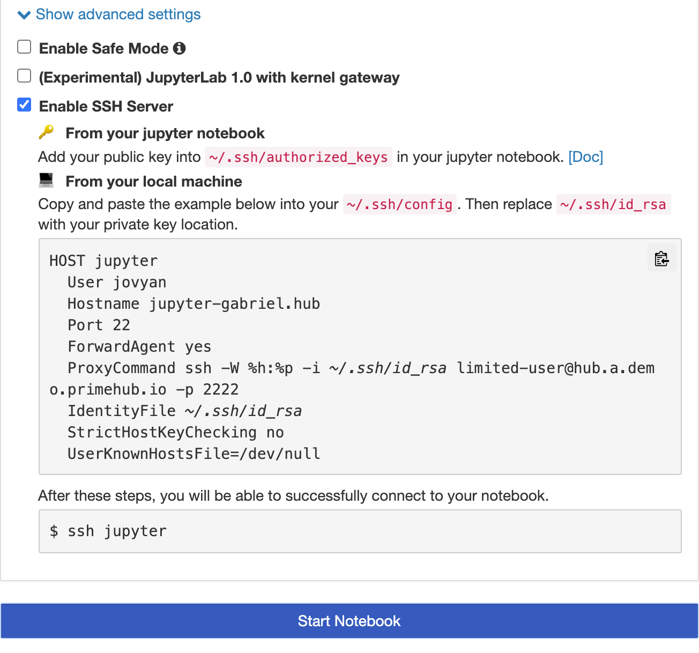
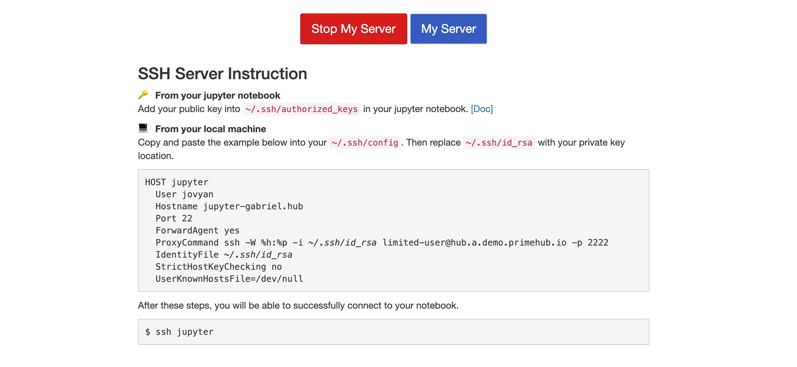
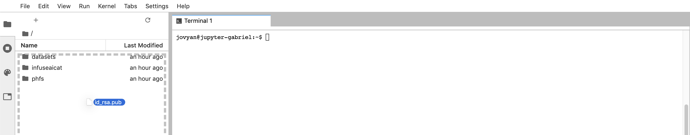

# SSH Server Feature

**PrimeHub** provides a feature of SSH Server that users are allowed to access into their own launched Notebook via **SSH**. A practical use-case is that users are able to use IDEs such as **VSCode** which has **remote-ssh** extension for the development remotely. In other words, it provides other possible development options for users who like to use rich-features IDEs instead.

### Enable SSH Server


To activate SSH Server, administrators have to configure SSH Server of PrimeHub. Please contact administrators and see [Configure SSH Server](../../../developer-guide/configuration/configure-ssh-server.md).



Before using this feature, you are required to have a **public/private key pair**, please go to [SSH key generation](generate-ssh-key-pair.md) to generate your own pair at local.


1.  Before starting a notebook, expand `Show advanced settings` and check `Enable SSH Server`.

    <figure><figcaption></figcaption></figure>
2. Hovering the cursor over the code block, copy the configuration by clicking the copy icon.
3. Press `Start Notebook` to launch the JupyterHub.
4. Go back to your local, edit the `~/.ssh/config` with adding the copied configuration at your local. Make sure `jupyter-<username>` and `~/.ssh/id_rsa`(private key) are correct according to your circumstance.


If you want to assign other private key, please change the path `~/.ssh/id_rsa` in the configuration to the desired one. If your key requires passphrase, you may want to add into [ssh-agent](https://www.ssh.com/ssh/agent).


### Deploy Public key into JupyterHub

After Notebook is launched,


In Notebook page, it shows the same instruction for the reference


<figure><figcaption></figcaption></figure>

1.  Drag-n-drop a public key (e.g. `id_rsa.pub`) from your local to the `File Browser` of the opened JupyterHub tab on browser.

    <figure><figcaption></figcaption></figure>
2.  Open `Terminal` on Notebook, run the commands

    ```bash
    mkdir -p ~/.ssh
    mv ~/id_rsa.pub ~/.ssh/authorized_keys
    ```
3.  Go back to your local, run the command for verification.

    ```bash
    ssh jupyter
    ```

    After SSH into the Notebook successfully, you should see the prompt:

    ```
    jovyan@jupyter-<your_username>:~$
    ```


Once the initial setup is completed, only step 1 is required for accessing Notebook via SSH.


### Practical Usecase - VSCode

If you are familiar with **VSCode**, check our guide, [VSCode + Remote-SSH](vscode-ssh-notebook-remotely.md).

### Troubleshooting

If **permission denied** or **connection refused** occurs, please check our advices for troubleshooting.
