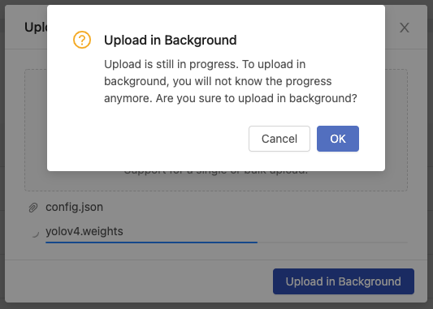
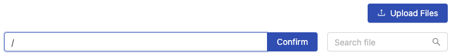
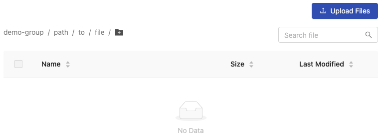
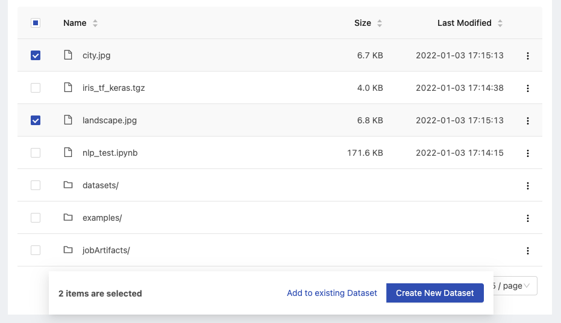
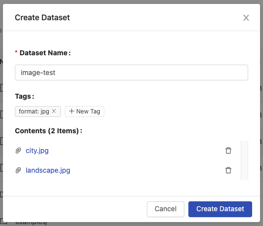
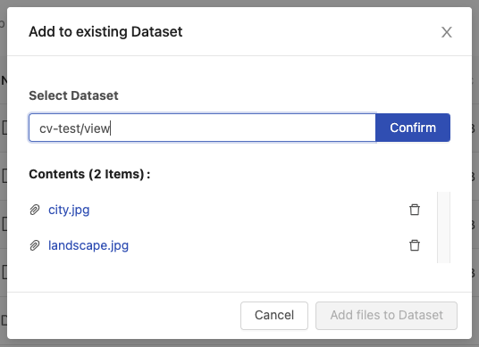
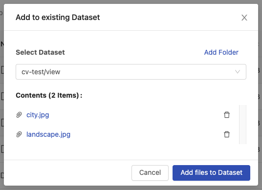

# Shared Files

The **Shared Files** feature is based on [PHFS Storage](../developer-guide/design/primehub-file-system-phfs.md) to store shared files. Group members are able to browse shared files and able to upload files for sharing with other group members.

<figure><figcaption></figcaption></figure>

### Browse

It lists files and directories with columns of `Name`, `Size`, and `Last Modified`. The list can be sorted by these columns.

* `<Directory>/`: navigate into the directory by clicking it.


Some directories are created by PrimeHub automatically, such as `jobArtifacts/`.


*   `<File>`: there are actions we can perform over files.

    * `View file`: view the file in an new tab if the file format is supported. E.g. image, text and notebook(_.ipynb_).
    * `Download file`
    * `Copy PHFS URI`: URI looks like `phfs:///<path/to/file>` (triple `/`); which can be used in Jobs.
    * `Delete`

    <figure><figcaption></figcaption></figure>

### Upload

Click `Upload` to pop up an uploader.

<figure><figcaption></figcaption></figure>

Click or drag files to start uploading them.

During uploading, the progress bar will show the progress of uploading.

<figure><figcaption></figcaption></figure>

We can click `Upload in Background` to move the uploading action to the background.

<figure><figcaption></figcaption></figure>

Once the uploading is done, the file will be listed in the `Shared Files` page.

Click `OK` to close the dialogue or click/drag to upload additional files.

<figure><figcaption></figcaption></figure>


Uploaded files can been only accessed by same group; please confirm the selected working group if files are not listed.


#### Create directory

Firstly, click the `+` icon.

<figure><figcaption></figcaption></figure>

Then input the name of sub-directory and click `Confirm`.

<figure><figcaption></figcaption></figure>

Example of typing the `path/to/file`.

<figure><figcaption></figcaption></figure>


The nested directories won't be created until a file is uploaded into, in other words, when showing `No data`, at this moment, no directories is created yet.


### Create/Update a Dataset

The `Shared Files` is the whole files storage and the [Datasets](datasets.md) is the specified collection of files that based on the `Shared Files`.

We can directly choose some files or directories from the `Shared Files` list, it will pop-up dialogue to `Create new dataset` or `Add to existing dataset`.

<figure><figcaption></figcaption></figure>

#### Create new dataset

Select `Create new dataset`, it will pop-up dialogue and we can input the `Dataset Name`, specify `Tags`, and view the file contents.

<figure><figcaption></figcaption></figure>

* `Dataset Name`: name of the dataset.
* `Tags`: tags of the dataset.
* `Contents`: the file contents of the current creation.

After specifying the values, click `Create Dataset`.

The dataset `image-test` is created successfully.

<figure><figcaption></figcaption></figure>

#### Add to existing dataset

In addition to creating a new dataset from the `Shared Files`, we can also add the files to an existing dataset.

Select `Add to existing dataset`, it will pop-up dialogue and we can select the existing dataset and view the file contents.

<figure><figcaption></figcaption></figure>

View selectable datasets. Here we select `cv-test`.

<figure><figcaption></figcaption></figure>

We can add files to the `cv-test` dataset directly or even add a sub-directory to the `cv-test` dataset by clicking the `Add folder`.

<figure><figcaption></figcaption></figure>

Input the sub-directory name `view` and click `Confirm`.

<figure><figcaption></figcaption></figure>

Ensure the update location and file contents are correct, click `Add files to Dataset`.

<figure><figcaption></figcaption></figure>

The dataset `cv-test` is updated successfully.

<figure><figcaption></figcaption></figure>
