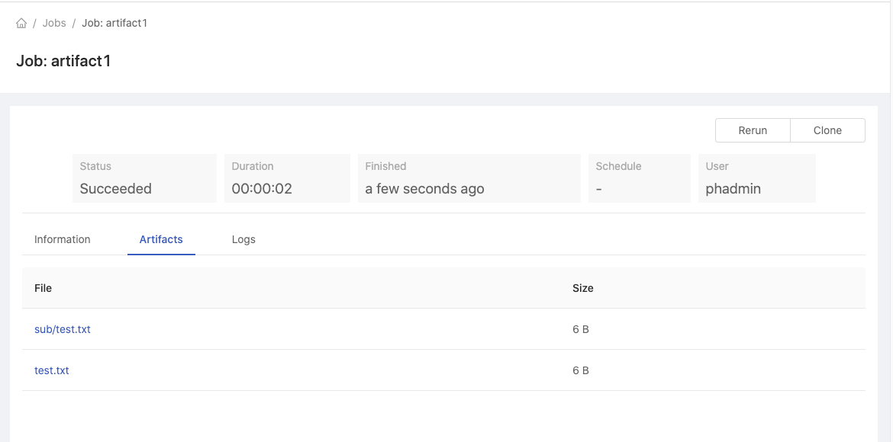
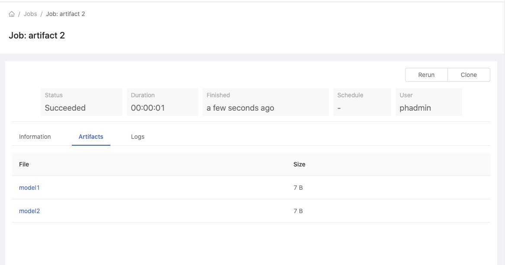

# Job Artifacts

Allows users to store the job output and can be downloaded from the job UI.

### Prerequisites

The feature is only enabled if PrimeHub store and PHFS is enabled.

### Create Artifacts

To put artifacts in a job, just create an `artifacts` folder (or said `/home/jovyan/artifacts`) and put files to be copied here. The steps are

1.  Create a job with the command

    ```
    mkdir -p /home/jovyan/artifacts/sub
    echo "hello" > /home/jovyan/artifacts/test.txt
    echo "hello" > /home/jovyan/artifacts/sub/test.txt
    ```
2. Go to the detail page of the newly created job.
3. Wait for the job completed
4.  Go to the **Artifacts** tab. You will see all the two artifacts we just created

    <figure><figcaption></figcaption></figure>

### Link Artifacts Folder

We can also create a symbolic link `artifacts` to the actual folder where the files to copy out are located.

1.  Create a job with the command

    ```
    mkdir -p mymodel
    echo "model1" > mymodel/model1
    echo "model2" > mymodel/model2
    ln -s mymodel /home/jovyan/artifacts
    ```
2. Go to the newly created job detail page.
3. Wait for the job completed
4.  Go to the **Artifacts** tab. You will see all the two artifacts you just created&#x20;

    <figure><figcaption></figcaption></figure>

### Retention

By default, the artifacts are kept only 7 days. The system will clean up the expired artifacts everyday.

### Size and File Count Limit

By default, a job can have at most `100MB` by size and `1000` artifacts. If a job exceeds the limit, no files would be copied.
