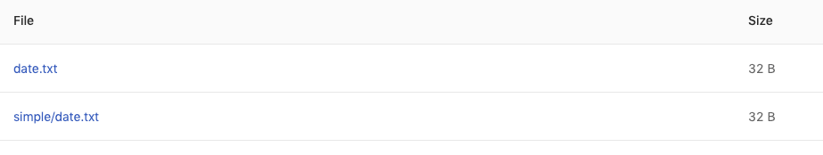
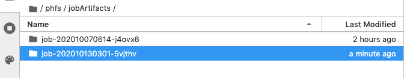
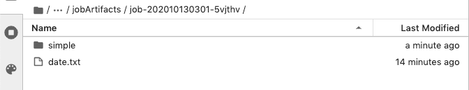

# Job Artifacts Simple Usecase

Enterprise Applicable to Enterprise tier only

This simple tutorial shows where to store generated data so called job artifacts during a job execution in `artifacts/` which is under a PHFS storage `/phfs/`. This storage is shared among same group members.

### Steps

1. Go to Jobs from User Portal and create a new job.
2. Confirm the current working group.
3. Select a instance type and image for a job.
4. Fill in `Job name` with _artifacts-simple_.
5.  Fill in `Command`; it creates a directory `artifacts/` which must be specified for storing generated artifacts. (Or creating a symbolic link of the other directory points to `artifacts/` works as well.)

    ```bash
    mkdir -p artifacts/simple
    date > artifacts/date.txt
    date > artifacts/simple/date.txt
    ```
6.  Use default timeout setting and submit the job.

    <figure><figcaption></figcaption></figure>

Once the job succeeded. View the job and generated data from tab Artifacts. Here right click on a link to view the content or to download a file.

Memorize the _Job ID_.

<figure><figcaption></figcaption></figure>

### From Notebook

From Notebook we can check these artifacts under `phfs/jobArtifacts/<JOB_ID>/`.

We also can see other job artifacts which are submitted by same group members. Under our JOB.

<figure><figcaption></figcaption></figure>

We can find these generated directories/files (job artifacts).

<figure><figcaption></figcaption></figure>
