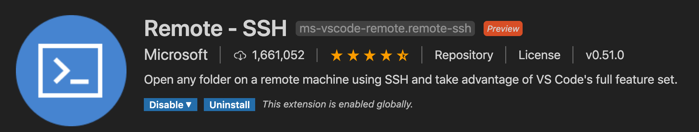
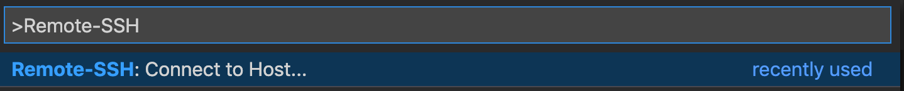
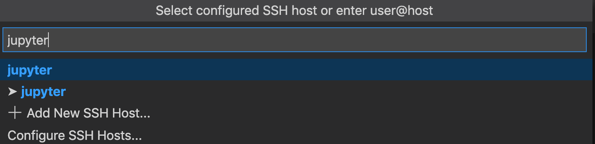
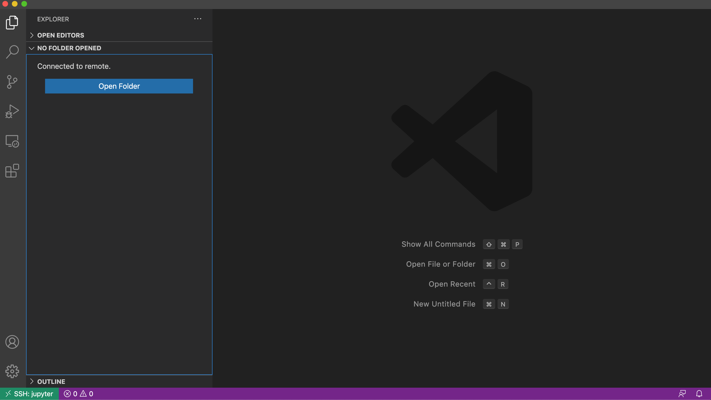
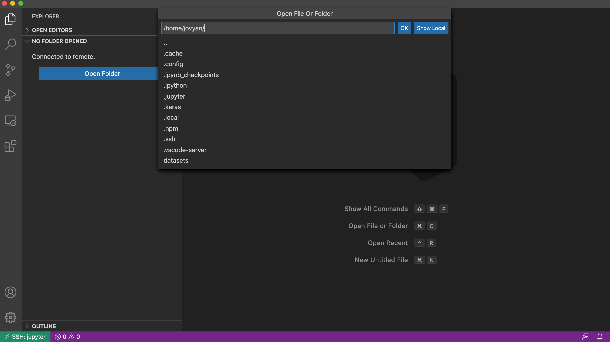
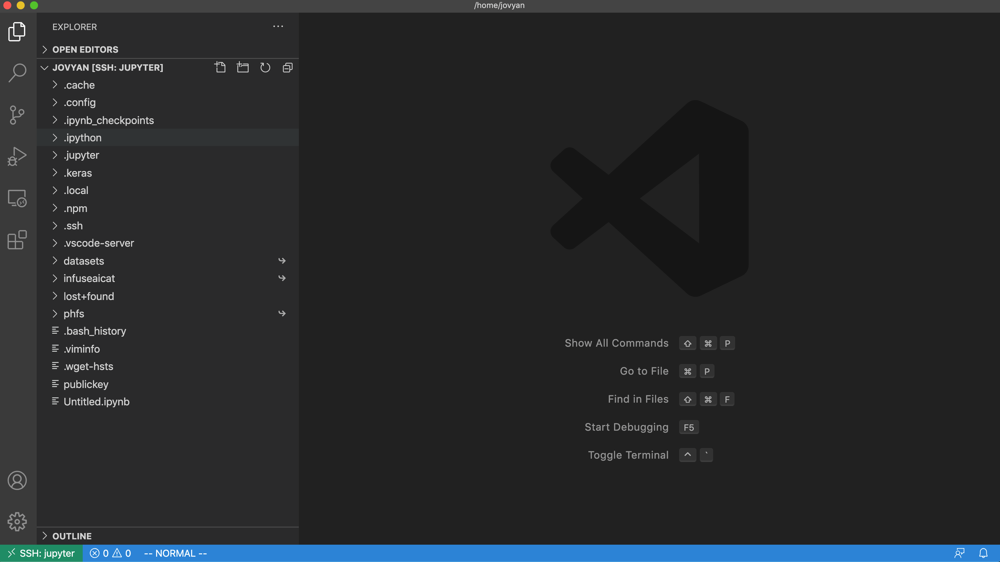

# VSCode SSH Notebook Remotely


This guide requires prerequisites of Notebook with enabled SSH Server feature and key-pair. Please go to SSH Server feature if it hasn't been set up yet.


### Steps

1.  Install the extension, [Remote - SSH](https://marketplace.visualstudio.com/items?itemName=ms-vscode-remote.remote-ssh) on VSCode.ssh

    <figure><figcaption></figcaption></figure>
2.  Press `Cmd+Shift+p`, type `Remote-SSH:Connect to Host...` and run it.

    <figure><figcaption></figcaption></figure>
3.  Select `jupyter` from listed hosts, it will open a new VSCode window.

    <figure><figcaption></figcaption></figure>
4.  Once SSH succeeds, open file explorer and click `Open Folder`

    <figure><figcaption></figcaption></figure>
5.  Open the folder, `/home/jovyan`.&#x20;

    <figure><figcaption></figcaption></figure>
6.  It shows files from `/home/jovyan` of remote Notebook.

    <figure><figcaption></figcaption></figure>
