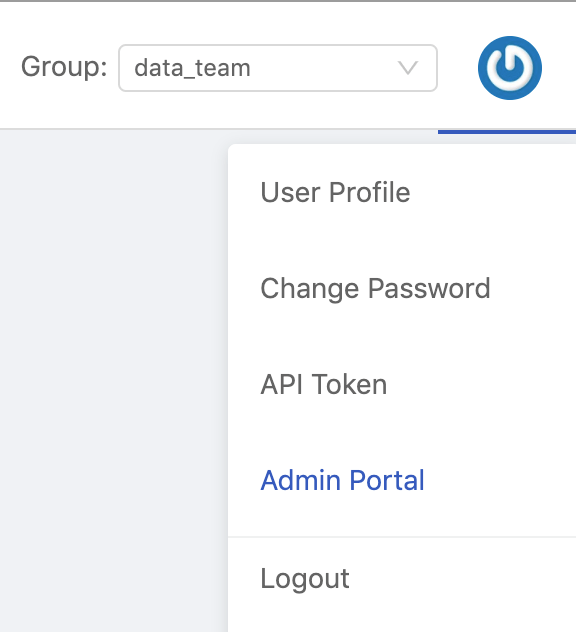
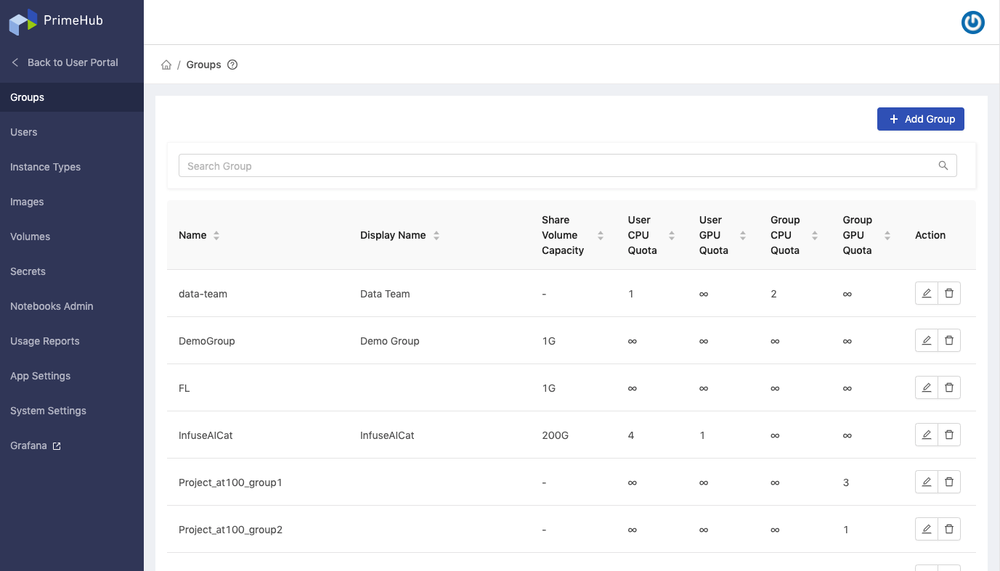

# Admin Portal

### Switch to Admin Portal

When login as an administrator, initially, you are landed on **User Portal**, click the Profile icon at top-right and select **Admin Portal** for the switch.

<figure><figcaption></figcaption></figure>

### Admin Portal

<figure><figcaption></figcaption></figure>

#### Profile Menu

Hovering over top-right icon, there is a Profile Menu containing **User Profile**, **Change Password** and **Logout** shortcuts.

### Administration Features

* `Groups` where Admin can manage groups. See Group Management.
* `Users` where Admin can manage users. See User Management.
* `Instance Types` where Admin can manage instance types. See Instance Type Management.
* `Images` where Admin can manage images. See Image Management.
* `Volumes` where Admin can manage volumes. See Volume Management.
* `Secrets` where Admin can manage secrets. See Secret Management.
* `Notebooks Admin` where Admin can manage Notebooks of users.
* `Usage Report` where Admin can review monthly reports of usage. See Usage Report. Enterprise
* `App Settings` where Admin can import customized apps. See App Settings.
* `System Settings` where Admin can configure system-wise settings. See System Settings.
* `Grafana` where Admin can view dashboards on **Grafana**.
