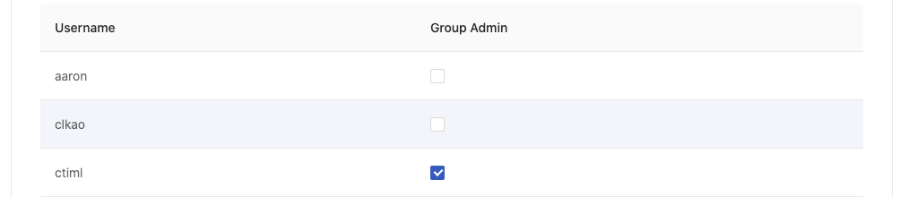

# Assign Group Admin

This quick-start guide shows how to assign the role of Group Admin to users.

1. Log in as an administrator and [switch to the Admin Portal](../admin-portal.md).
2. Click `Groups` in the left sidebar, and then click the pencil icon in the `Actions` column for the group you want to edit.
3.  In the `Members` section, click the checkbox next to a username to assign the role of Group Admin. Multiple users may be assigned the role of Group Admin.&#x20;

    <figure><figcaption></figcaption></figure>
4. Click `Confirm` to save your changes.

### Next

In the next quick-start, we will learn how to create instance types and images.
