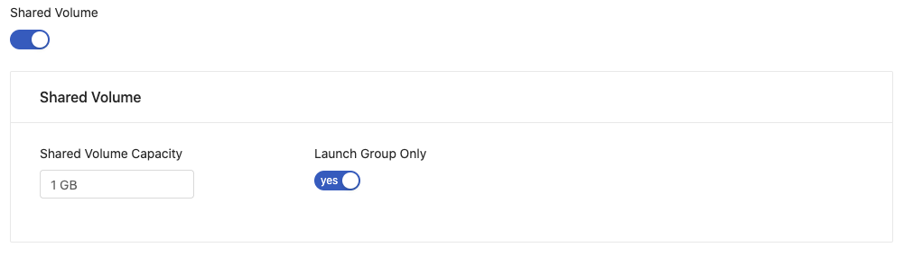

# Create Group

PrimeHub is group-centric. This means that users, instance types, images, and datasets must be assigned to a group. Without being assigned to a group, these elements cannot be utilized, and users will not be able to access any features of PrimeHub.

Groups allow a subset of users to share storage, such as datasets and shared volumes. Available computational resources can also be configured through assigning Instance Types to groups, allowing resource allocation on a per-project basis.

As users can be added to multiple groups, this means they can collaborate on many projects, and access different datasets with specific server resource configurations.

### Create a Group

1. Log in as an administrator and switch to the Admin Portal.
2. Click `Groups` in the left sidebar, then click the `+ Add` button.
3. Enter required information, such as `Name`
4. Toggle `Shared Volume` if a volume for sharing data among the group is required.
   1. Specify the `volume capacity`
   2.  To restrict access to only this group, leave `Launch Group Only` toggled to `yes` (default)&#x20;

       <figure><figcaption></figcaption></figure>
5. Adjust the `User Quota` resource allocation limit for users in this group (if required).
6. Adjust the `Group Quota` resource allocation limit for the group (if required).
7.  Click `Edit Users` to select and assign `Users` to this group.&#x20;

    <figure><figcaption></figcaption></figure>
8. Click `Confirm` to create the group.

We have now created a group, configured a shared volume and user/group quota, and added users.

### Next

In the next quick-start, we will learn how to assign a group admin.
