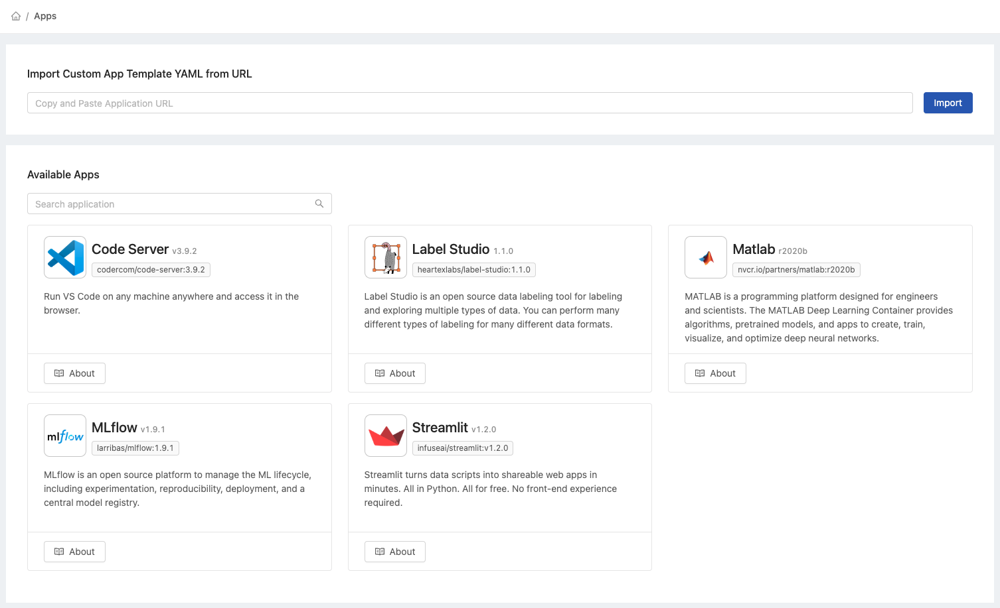

# App Settings

In `App Settings` administrators can manage their customized apps into the PrimeHub.&#x20;

<figure><figcaption></figcaption></figure>

### Import App

Follow the tutorial to know how to create your PrimeHub app using PhAppTemplate CRD.

We also hosted some well-known apps in the [awesome-primehub-apps](https://github.com/InfuseAI/awesome-primehub-apps) repository.

*   Let's use the [Streamlit app template](https://raw.githubusercontent.com/InfuseAI/awesome-primehub-apps/main/app-templates/streamlit.yaml) as an example. Fill in the URL of the app template and click `Import` button.&#x20;

    <figure><figcaption></figcaption></figure>
*   The `Streamlit` app is successfully imported.&#x20;

    <figure><figcaption></figcaption></figure>
*   In PrimeHub Apps, we can directly choose the imported app template and launch it as an app instance.&#x20;

    <figure><figcaption></figcaption></figure>
