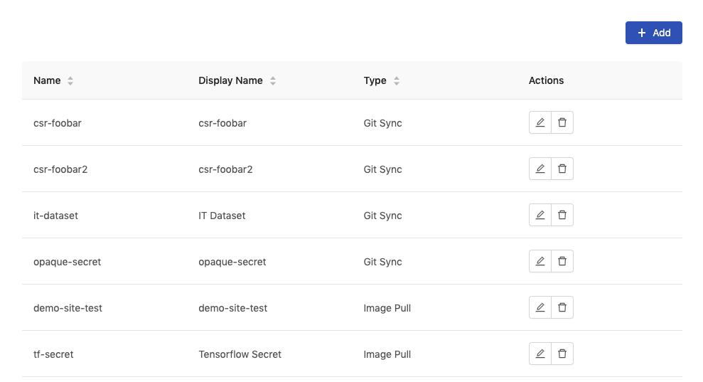
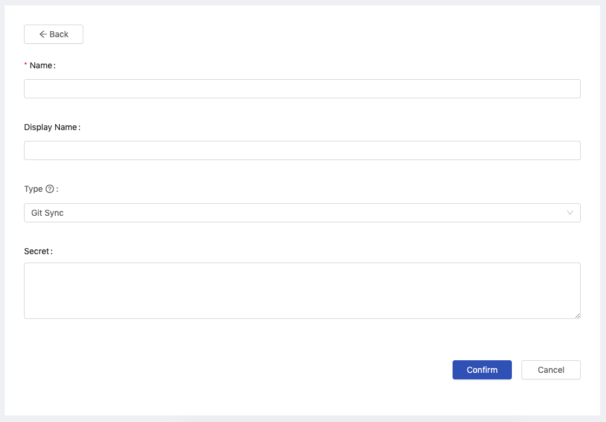
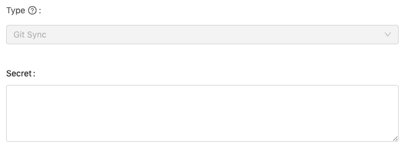
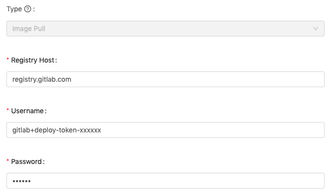

# Secret Management

Secret management provides the capabilities of managing secrets which are used for pull images or volumes, such as create, delete, edit secrets. Before adding secrets, we have to gain those generated secrets from sources of services.

### Creating New Secrets

<figure><figcaption></figcaption></figure>

Click `Add` to add a Secret and it will pop up the edit screen of Secret.

<figure><figcaption></figcaption></figure>

You need to fill in these fields:

* `Name`: (required): Only lowercase letters, numbers, hyphen `-` and a dot `.` can be filled in.
* `Display Name`
* `Type`: `Git Sync`, `Image Pull`

#### Type Git Sync

<figure><figcaption></figcaption></figure>

* `Secret`: A secret of Git Sync is used for pulling a data volume via git. The context is a private key related to a registered public key of ssh. Please see [Volume Management](volume-management/) to learn how to specify a pull-secret for a volume.

#### Type Image Pull

<figure><figcaption></figcaption></figure>

It uses the secret of `docker-registry` type to authenticate with a container registry to pull an image. The registry host and credentials are required. Please see [Image Management](image-management/) to learn how to specify a pull-secret for an image.

* `Registry Host`: The url of registry host.
* `Username`
* `Password`

Click `Confirm` to complete the addition.

### Gain and add secrets

* [Add pull secrets of private registry (GitLab)](admin-portal/pull-secret-for-gitlab.md)
* [Add gitsync secret of private repository (GitHub)](admin-portal/gitsync-secret-for-github.md)
