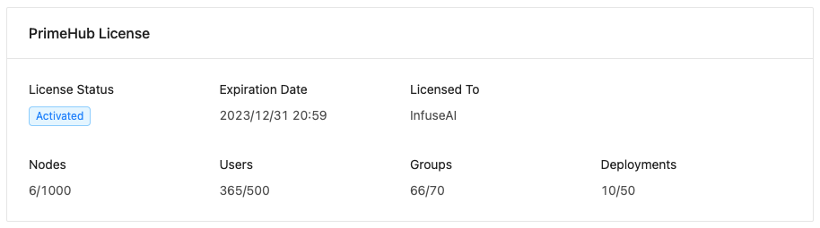
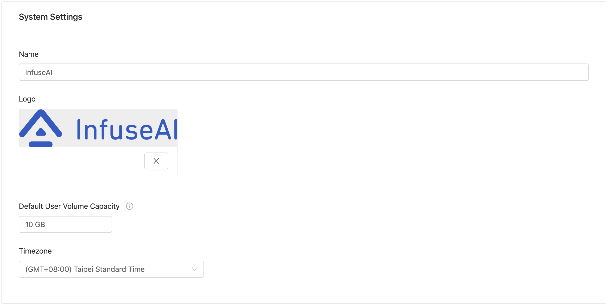
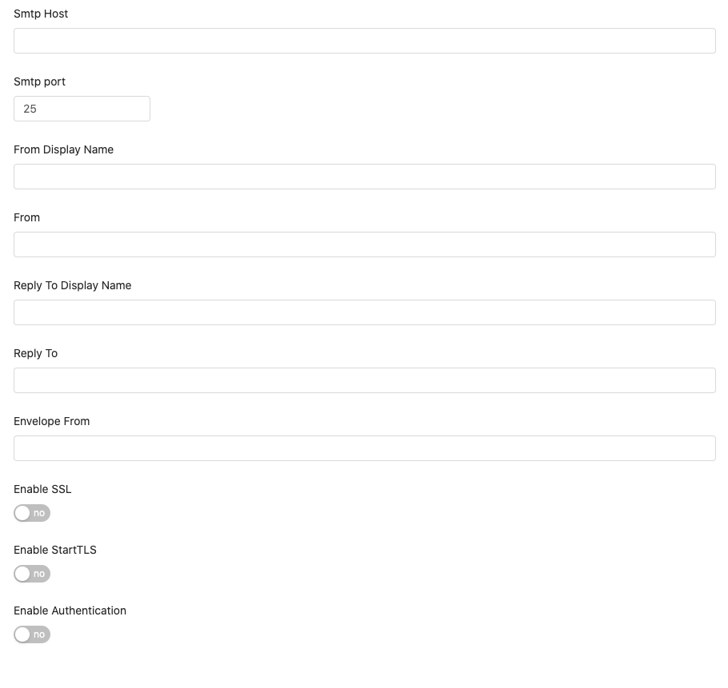

# System Settings

### PrimeHub License

<figure><figcaption></figcaption></figure>

Information of the PrimeHub license:

* `License Status`: `Activated` / `Unauthorized` / `Expired`; status of the license.
* `Expiration Date`: The expiration date of the license.
* `Licensed To`: Name of the organization that issued the license.
* `Nodes`: Used/Granted number of nodes.
* `Users`: Used/Granted number of users.
* `Groups`: Used/Granted number of groups.
* `Deployments`: Used/Granted number of deployed models.

#### License warning

A license issued by InfuseAI contains `Expiration Date`, `Maximum Nodes`, `Maximum Users`, and `Maximum Deployments`.


When a license has expired, a warning message appears:

<mark style="color:red;">Your license has expired. Please contact your sales team to extend your license.</mark>



When used node amount > granted node amount, a warning message appears:

<mark style="color:red;">You are using more nodes than your license allows. Please contact your system administrator.</mark>



When used user amount > granted user amount, a warning message appears:

<mark style="color:red;">Exceed Quota - Number of users exceeds license limitation.</mark>



When used deployment amount > granted deployment amount + 10%, a warning message appears:

<mark style="color:red;">Exceed Quota - Group Maximum Deployments exceeded</mark>


### System Settings

<figure><figcaption></figcaption></figure>

* `Name` your organization.
* `Logo` Click `+ add Image` to upload the logo.
* `Default User Volume Capacity` the default disk quota for user.
* `Timezone` the system timezone.

### Email Settings

<figure><figcaption></figcaption></figure>

* `SMTP Host` Sends the Sever host location of the email.
* `SMTP Port` Sends the Sever host port of Email.
* `From Display Name` A user-friendly name for the "From" address.
* `From` The From field in Email.
* `Reply To Display Name` A user-friendly name for the "Reply-To" address.
* `Reply To` The Reply-To field in Email.
* `Enable SSL` SSL encryption.
* `Enable StartTLS` Supports extended StartTLS.
* `Enable Authentication`
