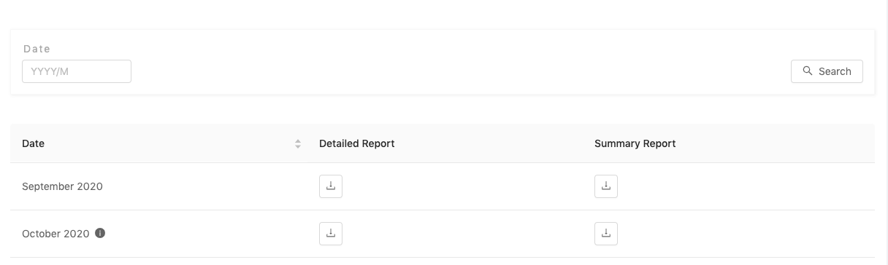
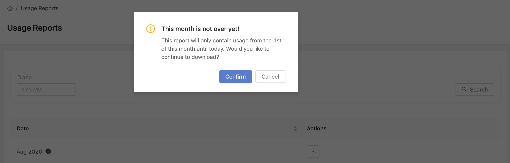

# Usage Reports

From PrimeHub v3.1, the new feature, `Usage Reports`, is introduced that administrators can have a overall insight of who/what consumed resources monthly.


**Usage** is defined by **allocated** resources, not by actual utilization. For example, when an user opens an Jupyter notebook, the record of the allocated resources is logged in the usage report, _even if the user doesn't run any program actually on it_. The each record includes the lifetime of a pod, and CPU/GPU/Memory are allocated/occupied for a pod.


### Download Report

<figure><figcaption></figcaption></figure>

Click **Detailed Report** or **Summary Report** of the month for downloading a csv file or search specific year-month by the format `YYYY/M` (e.g. 2020/7, 2020/12) in `Date` search field.

You even can download the report of the current month which is not over yet. It will have a pop-up to inform you that the data of current month is not intact. Just click `Confirm` for downloading.

<figure><figcaption></figcaption></figure>

### Detailed Report

There are some insightful data of usage:

| Item                     | Description                                  |
| ------------------------ | -------------------------------------------- |
| **report\_month**        | the report is for which year and month       |
| **group**                | which group which component runs at          |
| **user**                 | which user uses resources                    |
| **component**            | such as `job`, `notebook`, `model_deploy`    |
| **component\_name**      | the name of the component                    |
| **cpu\_core\_hours**     | hours if the computing work runs in a CPU    |
| **gpu\_core\_hours**     | hours if the computing work runs in a GPU    |
| **gb\_memory\_hours**    | hours if the computing work uses 1 GB memory |
| **usage\_hours**         | hours the computing work has done            |
| **instance\_type**       | instance type                                |
| **instance\_cpu\_core**  | vCPU cores of the instance                   |
| **instance\_gpu\_core**  | GPU cores of instance                        |
| **instance\_memory\_gb** | memory of the instance                       |
| **pod\_name**            | name of the pod                              |
| **k8s\_uid**             | Kubernetes object id                         |
| **start\_time**          | time pod began running                       |
| **end\_time**            | time pod finished running                    |
| **running**              | if it's still running                        |

### Summary Report

There are some insightful data of usage:

| Item                  | Description                                  |
| --------------------- | -------------------------------------------- |
| **report\_month**     | the report is for which year and month       |
| **group**             | which group which component runs at          |
| **user**              | which user uses resources                    |
| **component**         | such as `job`, `notebook`, `model_deploy`    |
| **gpu\_core\_hours**  | hours if the computing work runs in a GPU    |
| **cpu\_core\_hours**  | hours if the computing work runs in a CPU    |
| **gb\_memory\_hours** | hours if the computing work uses 1 GB memory |
| **usage\_hours**      | hours the computing work has done            |
| **running**           | if it's still running                        |
