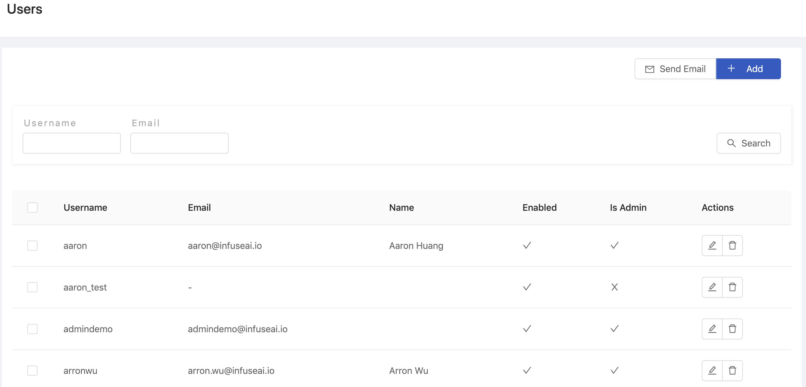
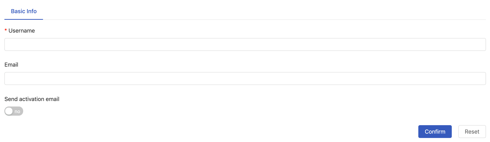
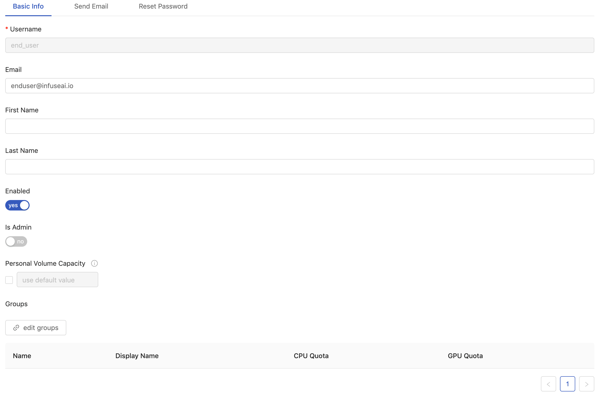
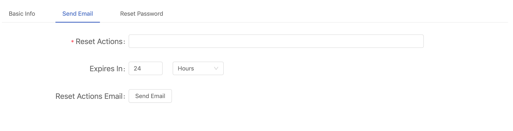
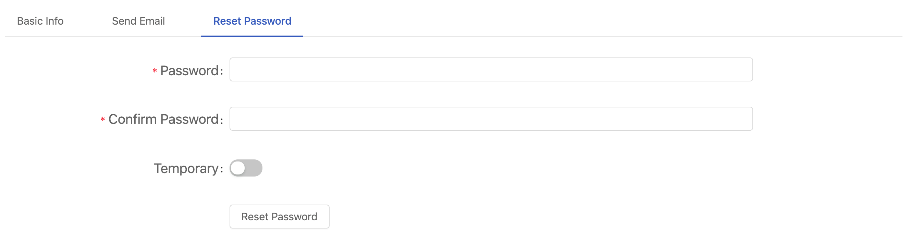

# User Management

<figure><figcaption></figcaption></figure>

### Creating New Users

Click `+ Add` to add a user and it will pop up the edit screen of Users.

<figure><figcaption></figcaption></figure>

There have `Username` and `E-mail` need to fill, click `Confirm` to complete.

### Editing User

Click Edit button of Actions to enter the edit page of the User.

#### Basic Info

<figure><figcaption></figcaption></figure>

Edit user information & set user usage items on this screen, including:

* `Is Admin` Set the user as Admin.
* `Enable` Disable the user.
* `Personal Volume Capacity` Volume size for the user.

#### Editing Groups

Click `edit groups` under the edit user's screen, and to select the group to which the user belongs from the existing groups list and link them.

<figure><figcaption></figcaption></figure>

#### Send Email

<figure><figcaption></figcaption></figure>

The administrator can request the user to reset following settings through system E-mail:

* `Update Password` Require users to update their passwords.
* `Configure OTP` Require users to set up OTP on their device using google authentication or other OTP software (one-time password).
* `Verify Email` The user is required to verify the E-mail and e-mail the verified link to the user.
* `Update Profile` Require users to update their profile.

#### Reset Password

<figure><figcaption></figcaption></figure>

Require users to reset their password. Please enter your password twice. If `Temporary` is turned on, the new password only be used once, and the user must change the password immediately after logging in.
