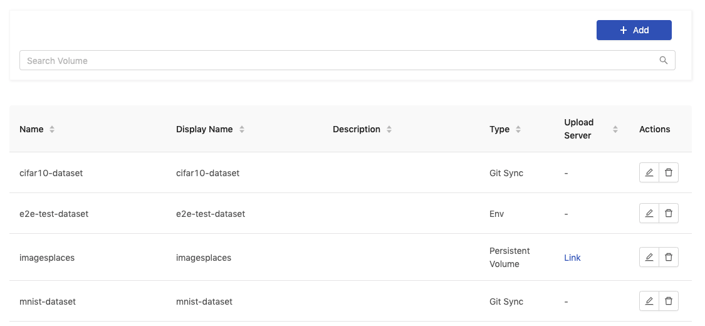
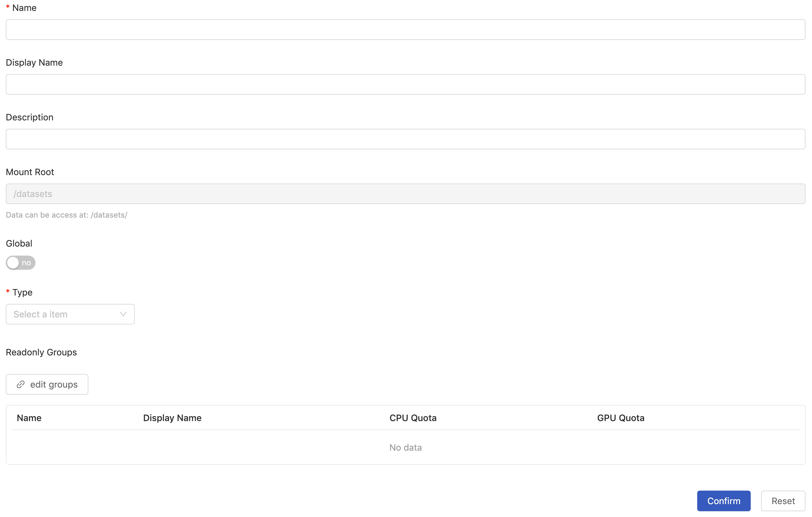
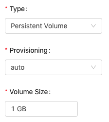
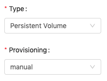
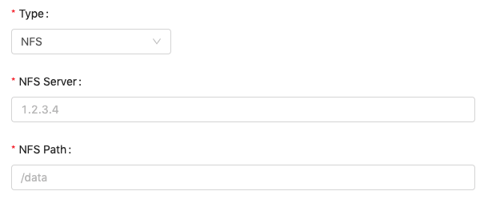
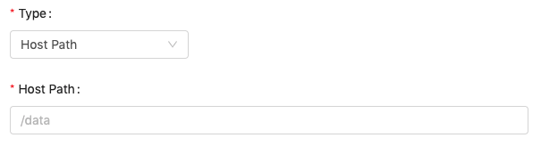
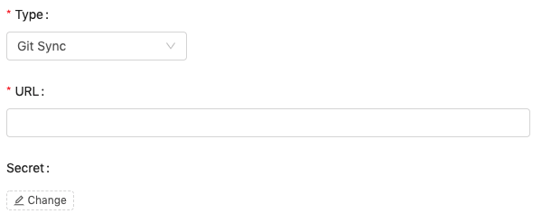
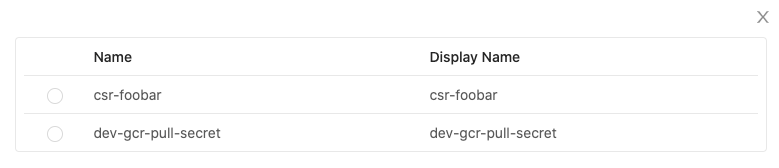
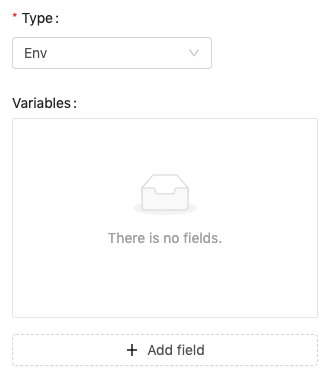

# Volume Management

Enterprise Applicable to Enterprise EditionCommunity Applicable to Community Edition

Volume management provides the capabilities of managing volume resources such as create, delete, edit volumes and of permission-control so that volumes can be accessed only by specific groups accordingly.

### Creating New Volume

<figure><figcaption></figcaption></figure>

Click `Add` to add a Volume and it will pop up the edit screen of Volumes.

<figure><figcaption></figcaption></figure>

You need to fill in these fields:

* `Name` (required): Only lowercase letters, numbers, hyphen `-` and a dot `.` can be filled in.
* `Display name`
* `Description`
* `Mount Root` This field is not editable. It displays the path to volumes.
* `Global` If enabled, everyone can read this volume; furthermore, we can set `Writable` groups. If disabled, linking groups with `ReadOnly` or `Writable` permission by `edit groups` is required.
* `Type` Volume type.
* `Edit Groups` Set accessible groups, when `Global` is disabled.

There are several `type`:

#### Persistent Volume

* `Provisioning`: `Auto`, `Manual`.

**Auto**

<figure><figcaption></figcaption></figure>

Specifying the `volume size`, once it is confirmed, there is a fixed-size volume created and the volume size is not changeable by editing the volume.

**Manual**

<figure><figcaption></figcaption></figure>

Setting provisioning `Manual` allows administrators configure the persistent volume manually with an existing storage. Generally, it is used for storages types which are not listed in PrimeHub Volume. Please refer to the [Kubernetes official documentation](https://kubernetes.io/docs/concepts/storage/persistent-datasets/) for the configuration.

The only rule you need to follow is that the `PersistentVolumeClaim` name must be `volume-{"Name" field set via UI}`.

Click `Confirm` to complete the addition.

***

#### NFS

<figure><figcaption></figcaption></figure>

An nfs volume allows an existing NFS(Network File System) share to be mounted into the pod. The data of an nfs volume is preserved even if the volume is unmounted. NFS can be mounted by multiple groups simultaneously.

NFS settings remain editable after the creation.

> You must have an existing NFS server running with the share exported before you can use it, otherwise unexpected behaviors which are varied with circumstances occur. Please see trouble-shooting.

* `NFS Server` Fill in the URL of the server.
* `NFS Path` Fill in the path to the share.

***

#### Host Path

<figure><figcaption></figcaption></figure>

In PrimeHub, a hostPath volume mounts a directory from the hosting node's filesystem into the pod.

> The hostpath/to/directory must exist on nodes and corresponding permissions must be granted, otherwise unexpected behaviors which are varied with circumstances occur. Please see trouble-shooting.

* `HostPath` Fill in the path to a directory. The setting remains editable after the creation.

***

#### Git Sync

<figure><figcaption></figcaption></figure>

Fill the URL of git repo (can be https or git). You can use `#branch` to specify the branch or tag name.

Click `Change` to select a secret from the list if a credential is required.

<figure><figcaption></figcaption></figure>

***

#### Env

<figure><figcaption></figcaption></figure>

If volume is an environment variable, not a file, you can use `env` type. Clicking `+ Add field` to add fields and fill the `key` and `value`.

> Please be noticed that any `-` will be replaced by `_` in full variable name; the _full name_ of env variables will be `<volume_name>_<variable_key>` in the circumstance.

***

#### Groups Access Control

<figure><figcaption></figcaption></figure>

`Type`, `Global` and `edit groups` are associated.

* When `Type` of a volume is **writable**:
  * `Global` is **enabled**, required to specify groups with writable permission, the rest of groups are read-only.
  * `Global` is **disabled**, required to specify groups with writable/read-only permission respectively.
* When `Type` of a volume is **read-only**:
  * `Global` is **enabled**, all of groups are read-only by default.
  * `Global` is **disabled**, required to specify groups with read-only permission.

In terms of type `pv`, `nfs` and `hostpath` volume, we can turn on `Upload Server` feature on the volume editing page. See Upload Server.
