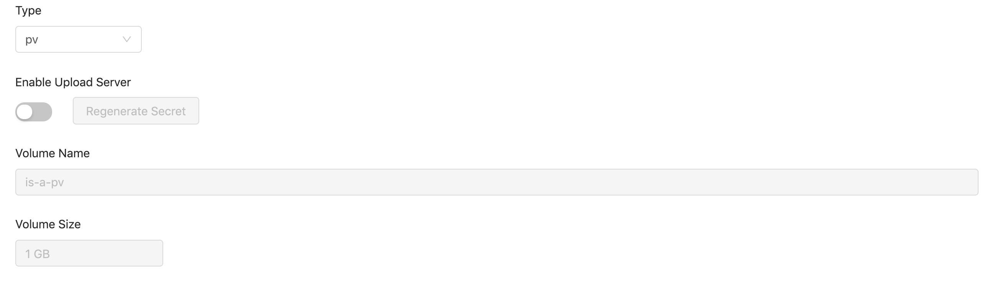
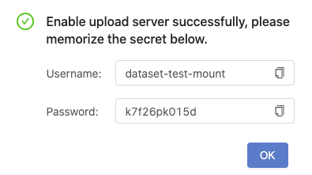
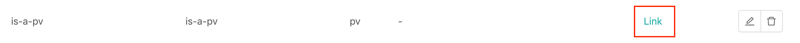
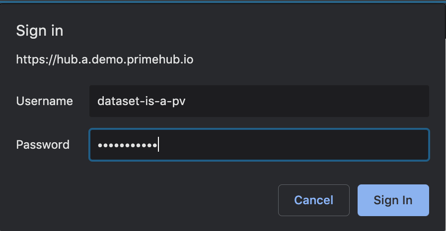
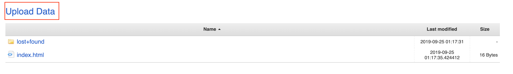
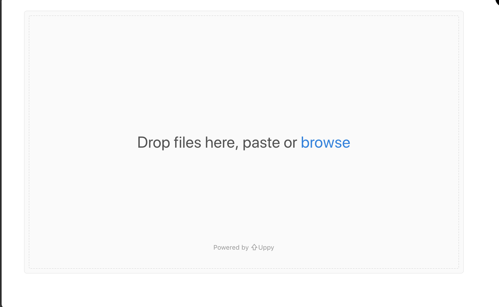
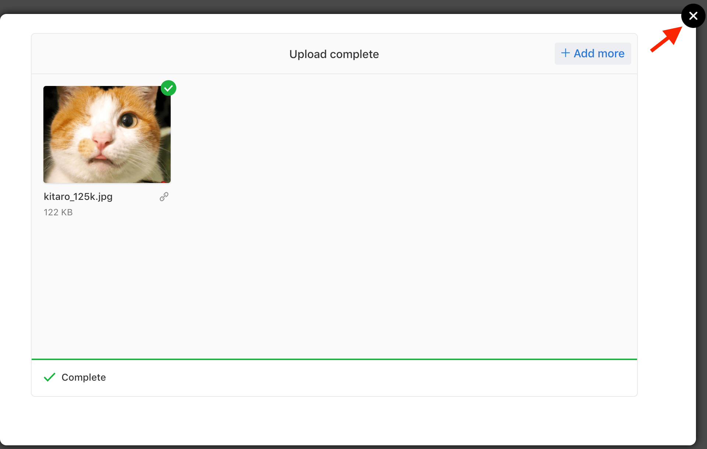
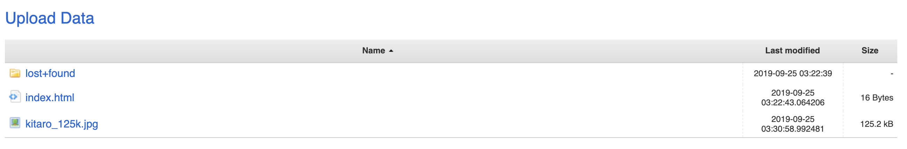

# Upload Server

In terms of type `pv`, `nfs` and `hostpath` volume, we can use `Upload Server` feature that allows users to upload files to a volume.

**Editing** a created type `pv`, `nfs` and `hostpath` volume, we should see `Enable Upload Server` toggle and `Regenerate Secret` button.

<figure><figcaption></figcaption></figure>

Toggle `Enable Upload Server` on, and click `Confirm`. There is a pop-up showing the credential (`Username` / `Password`) for the uploader access.

<figure><figcaption></figcaption></figure>

Since the credential shows once only, you **must** keep it in a memo before clicking `OK`.

**Note: if credential is lost** you can go back to volume editing page and click `Regenerate Secret` button again to have a new pair of credential.

You can see a `Link` created in `Upload Server` field of the volume.

<figure><figcaption></figcaption></figure>

Clicking the link, and input the credential you keep in the memo.

<figure><figcaption></figcaption></figure>

After login the upload server, it displays a file list and click `Upload Data`.

<figure><figcaption></figcaption></figure>

A upload dialogue appears.

<figure><figcaption></figcaption></figure>

Dragging files for uploading, files are not uploaded yet at this moment.


Uploader supports **auto-unzip** to a zip file. Dragging a **zip** file in, the file will be **unzip automatically** and the directory structure is remained.


Click `Upload n files` to trigger the upload. It shows **Complete** at bottom of the uploader once finished.

Close the uploader and back to the file list, uploaded files are listed.

<figure><figcaption></figcaption></figure>

You can find these uploaded files in the volume which is mounted on the hub in your jupyter notebook. Currently these files can be removed only via notebook.

<figure><figcaption></figcaption></figure>
