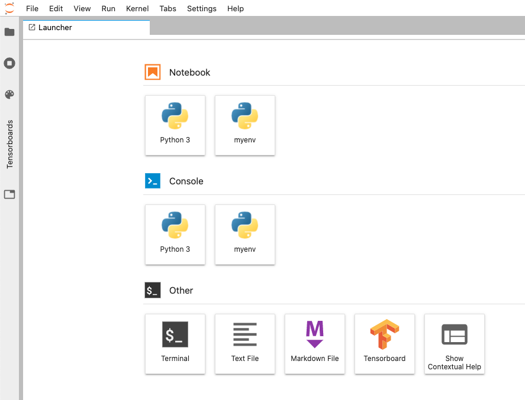
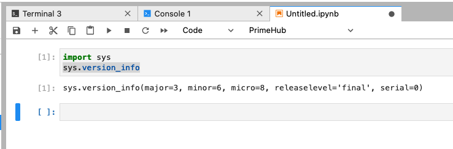
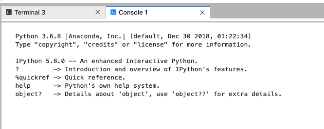
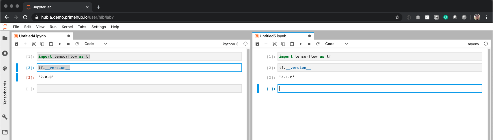

# Multiple Jupyter Notebook Kernels

### Goal

Use Coda or venv to manage packages environment with specific Python versions

<figure><figcaption></figcaption></figure>

### What is virtual environment

> A cooperatively isolated runtime environment that allows Python users and applications to install and upgrade Python distribution packages without interfering with the behaviour of other Python applications running on the same system.

[Reference: Virtual Environments and Packages ⇗](https://docs.python.org/3/tutorial/venv.html)

> We can choose the Conda way or the standard Python way to achieve it.

### Use Conda

Ensure Conda is installed

```bash
conda –V
```

Update Conda

```bash
conda update conda
```

Create a new environment with desired Python version

```bash
conda create --name myenv python=3.6.8
```

Activate the new environment

```bash
source activate myenv
```

In the new environment, install ipykernel

```bash
conda install ipykernel
```

Register a new ipykernel

```bash
python -m ipykernel install --user --name myenv
```

Launch a new Notebook using the `myenv` kernel

<div>

<figure><figcaption></figcaption></figure>

 

<figure><figcaption></figcaption></figure>

</div>


In the notebook script `!python -V` may return the incorrect version. The system level Python may be returned, and not the version in use in the current kernel environment.


***

### Use virtualenv(venv)

Open Terminal and run, it will create a venv corresponding to the specific\_python\_version

```bash
/path/to/specific_python_version -m venv myenv_py_version
```

and activate/switch to the venv:

```bash
source myenv_py_version/bin/activate
```

then install iPython kernel package and register a new ipykernel in the current venv:

```bash
pip install ipykernel
python -m ipykernel install --user --name=myenv_py_version --display-name "Python <specific_version>"
```

list available kernel spec for the verification

```bash
jupyter kernelspec list

# e.g. output
$ Available kernels:
  myenv_py_version      /home/jovyan/.local/share/jupyter/kernels/myenv_py_version
  python3    /home/jovyan/.local/share/jupyter/kernels/python3
```

Activate virtualenv

```bash
source myenv_py_version/bin/activate
```

Launch Notebook with specific kernel/venv

<figure><figcaption></figcaption></figure>

Switch Notebook Kernel anytime

<figure><figcaption></figcaption></figure>

Verify Python version in Notebook

```python
# run the code in a cell
import sys
sys.version_info

# e.g. output
# sys.version_info(major=3, minor=6, micro=8, releaselevel='final', serial=0)
```

### Install the specific library version in the virtual environment

Activate the specific virtual environment.

The Conda way

```bash
source activate myenv
```

or the standard Python way

```bash
source myenv_py_version/bin/activate
```

Then install the specific library version in this virtual environment. The dependency in this environment is independent from others.

```bash
pip install tensorflow==2.1
```

The library/package version varies with different kernels(virtual environment)

<figure><figcaption></figcaption></figure>
