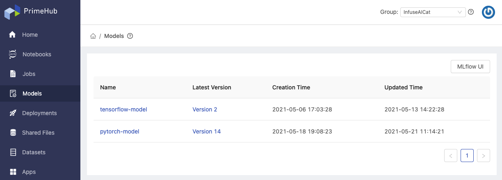
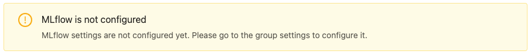
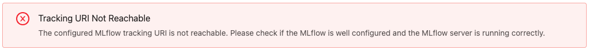
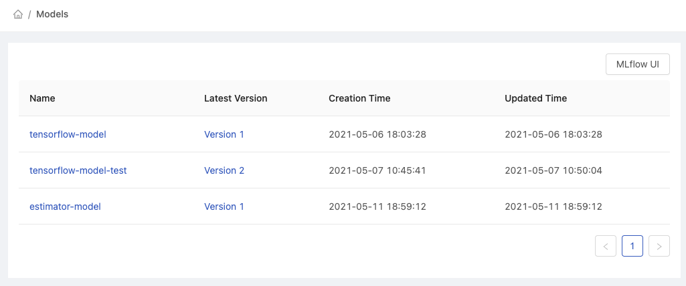
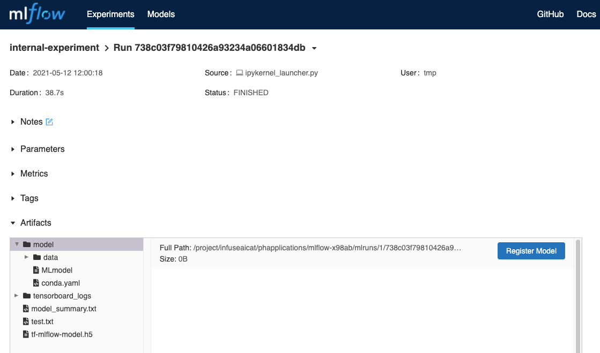
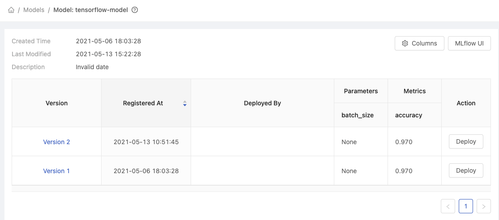
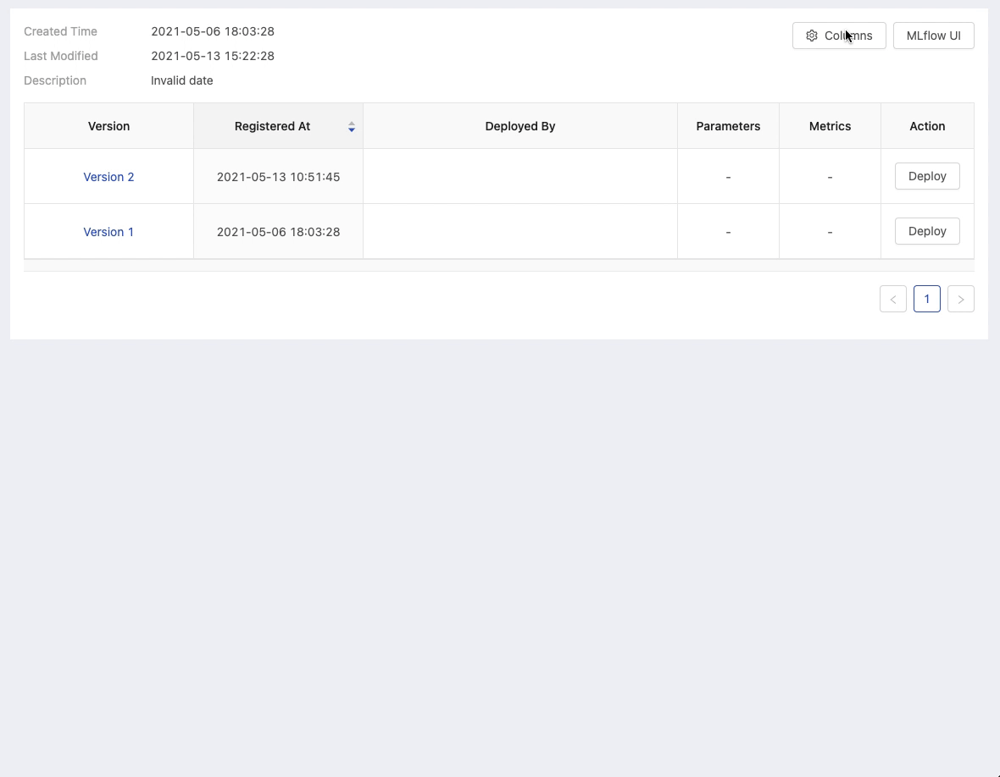
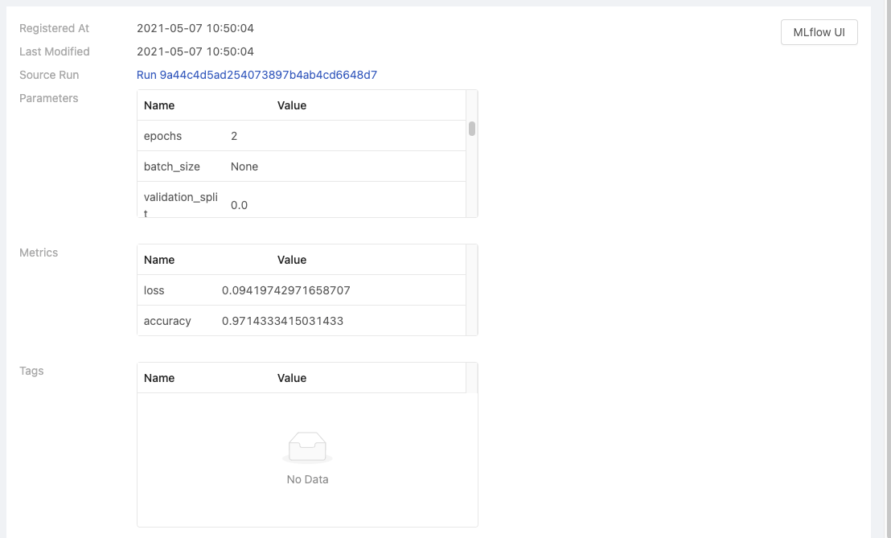
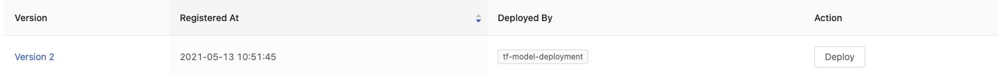

# Models Management

Data scientists requires to repeat training models with various combinations of dataset, feature, parameters etc., and conducting experiments on models, furthermore, to register/to version models which have decent performance according to results. Nowadays, this is one part of MLOps.

Regarding managing versioned models, PrimeHub, by integrating well-known _MLflow_, provides models management feature, **Models** that scientists can examine the performance of versioned/registered models and deploy a selected model directly as a service by **Deployments** on PrimeHub.

<figure><figcaption></figcaption></figure>

### MLflow is required

A running installed [MLflow instance](../apps/tutorial/create-an-mlflow-server.md) is required and [Group Setting](../group-admin/settings.md) has to be configured with relative information.

**MLflow setting is not configured yet**

<figure><figcaption></figcaption></figure>

**Mlflow instance is not reachable/running**

<figure><figcaption></figcaption></figure>

### Models

The page displays registered models from binding MLflow.

* See [Tutorial: Use MLflow Tracking](../apps/tutorial/create-an-mlflow-server.md).


If a loading page displays only, please double check `MLflow Tracking URI` configuration of MLflow setting in Group Setting.


<figure><figcaption></figcaption></figure>

* `MLflow UI` button: navigate to binding MLflow server in a new tab.

As long as an experimental model is registered on MLflow, it is listed in Models on PrimeHub as well.

<figure><figcaption></figcaption></figure>

#### Versioned Model List

By clicking each model name, it navigates into the list of versioned models.

<figure><figcaption></figcaption></figure>

* `Version`: Version number
* `Registered At`: The registration date/time
* `Deployed By`: The deployment name if the model is used for a deployment; click to navigate into the deployment detail page.
* `Parameters`: selected parameters of the model
* `Metrics`: selected metrics of the model
* `Deploy` button: Deploying the selected versioned model.

**Parameters and Metrics**

Clicking `Columns` and select parameters and metrics to display as columns in the table.

<figure><figcaption></figcaption></figure>

#### Versioned Model Detail

The page displays the information regarding this version.

<figure><figcaption></figcaption></figure>

* `Registered At`
* `Last Modified`
* `Source Run`: linking to the run on MLflow
* `Parameters`: if any
* `Metrics`: if any
* `Tags`: if any

### Deploy Versioned Model

In order to deploy a certain versioned model, click `Deploy` of a versioned model and select `+ Create new deployment` or update an existing deployment. It will navigate to Deployment page, continue to submit the deployment with mandatory information.

<figure><figcaption></figcaption></figure>

#### Deployed

The model which is used for the deployment is with the information of the **deployment name** under `Deployed by` column. Click the deployment will navigate into the [deployment detail](../deployments/#deployment-detail) page.

<figure><figcaption></figcaption></figure>

From the deployment information page, `Model URI` presents `models:/<model_name>/<model_version>`, e.g., `models:/tensorflow-model/2`.

* `models:/`: the model which is tracked by MLflow is deployed from Model Management
* `<model_name>`:the name of the model
* `<model_version`: the version number of the model

See [Tutorial: Manage and Deploy a Model](manage-and-deploy-model.md).
