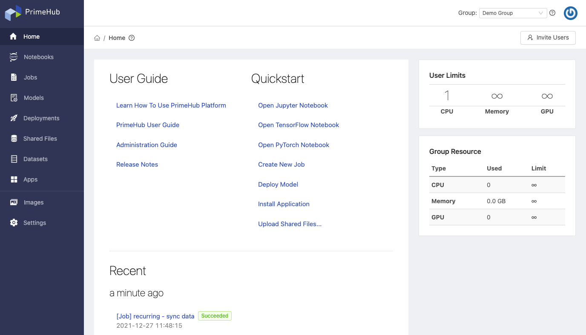
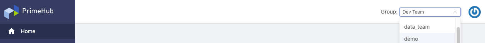
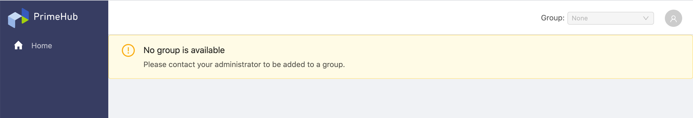
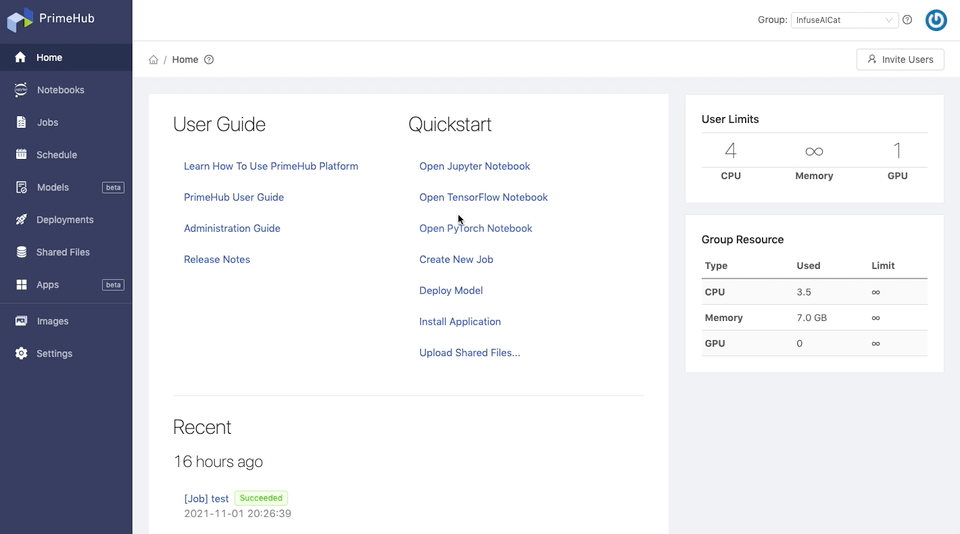

# User Portal

## Portal

<figure><figcaption></figcaption></figure>

On Portal, the left side is **side menu** composed of platform user features, the right side is the **context of the current working group**. At the top-right, there is a `Group:` dropdown of switching working groups. Users can switch the working group to proceed to different projects easily.

### Group-Context Switch

First of all, users have to specify a working group from joining groups by using the dropdown. Accordingly, the following right-side context is retained within the working group, it is so called **Group-Context**.

<figure><figcaption></figcaption></figure>


If users don't belong to any group, the page shows `No group available` without any features. Please contact administrators.


<figure><figcaption></figcaption></figure>

### Home

At Home, the layout has multiple areas:

*   **User Guide/Quickstart**: it has links of external documents where users can get started from and shortcuts of features where users can take actions quickly.

    _Quick-launch for TensorFlow and PyTorch_

    <figure><figcaption></figcaption></figure>
*   **Resource Usage:** the section displays the current status of resource usage. It lists all of being used resources by types/group users.&#x20;

    <figure><figcaption></figcaption></figure>
* **Recent**: the section displays recent activities (such as Job, Model) done by the user; where users can have an quick-view of activities status.
* **Resource Dashboard**: the section displays _permitted user quota in this group_ and _used/limit group quotas_.
* **Invite Users**: it makes possible to invite more users to experience PrimeHub via the _invitation link_.

### Profile Menu

Hovering over top-right icon, there is a Profile Menu containing **User Profile**, **Change Password**, **API Token**, **Admin Portal** and **Logout** shortcuts.

## User Feature

* **Notebooks** where users can launch a Jupyter Notebook for projects. See [Notebook environment](start-notebook/).
* **Jobs** where users can submit jobs of time-consuming tasks. See [Jobs](jobs-recurring-jobs/).
* **Recurring Jobs** where users can schedule jobs regularly. See [Recurring Jobs](jobs-recurring-jobs/#recurring-jobs).
* **Models** where users can track registered models from MLFlow. See [Models Management](models/model-management-configuration.md).
* **Deployments** where users can deploy and serve models as services. See [Deployments Management](../technology/user-portal/broken-reference/).
* **Shared Files** where users can upload files to PHFS storage to share with group members. See [Shared Files](shared-files.md).
* **Datasets** where users can manage datasets. See Datasets Management.
* **Apps** where users can install 3rd-party applications to extend capabilities of PrimeHub. See [PrimeHub Apps](../technology/user-portal/broken-reference/).

### Group admin feature

Features here are Group-Admin only.

* **Images** where Group Admin can add/build group-specific images for the managed group. See [Images](group-admin/images.md).
* **Settings** where Group Admin can view settings configured by Platform Admin of the managed group and modify the default timeout setting of Jobs. See [Settings](group-admin/settings.md).


Please contact administrators to acquire Group Admin privilege.

